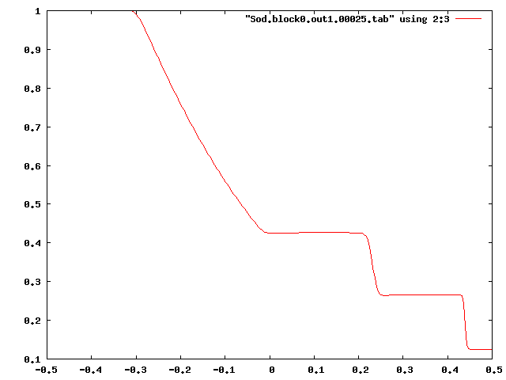
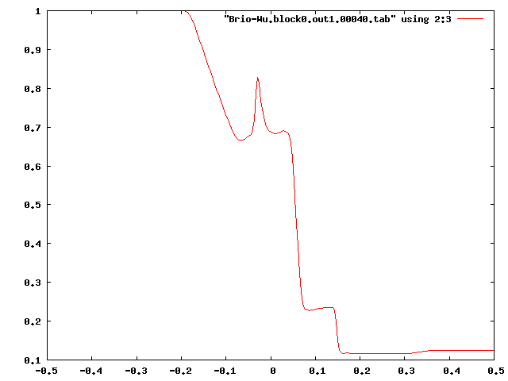

### Sod Shock Tube Test

This is a step-by-step introduction to run the 1D Sod shock tube test problem with Athena++. For simplicity, the GNU C++ compiler (default) is used. If you want to use another compiler, see [[Configuring]].

0\. Move into the Athena++ code root directory.
```
    > cd athena
    > pwd
    /home/(yourname)/athena
```
1\. Configure the code.
```
> python configure.py --prob shock_tube
Your Athena++ distribution has now been configured with the following options:
  Problem generator:       shock_tube
  Coordinate system:       cartesian
  Equation of state:       adiabatic
  Riemann solver:          hllc
  Reconstruction method:   plm
  Hydro integrator:        vl2
  Magnetic fields:         OFF
  Special relativity:      OFF
  General relativity:      OFF
  Frame transformations:   OFF
  Viscosity:               OFF
  Compiler and flags:      g++  -O3
  Debug flags:             OFF
  Linker flags:
  MPI parallelism:         OFF
  OpenMP parallelism:      OFF
  HDF5 Output:             OFF
```

2\. Clean up any old files from the last compilation.
```
    > make clean
```
3\. Build the code. The executable file will be created in `bin/`.
```
    > make
```
4\. Create a working directory somewhere and move there.
```
    > cd ~
    > mkdir work
    > cd work
```
5\. Copy the sample input file to the working directory.
```
    > cp ~/athena/inputs/hydro/athinput.sod .
```
6\. Run the code using the input file.

The code will print information about each time step, and finish with diagnostic information like zone-cycles/second.
```
> ~/athena/bin/athena -i athinput.sod
RootGrid = 1 x 1 x 1
MeshBlock 0, rank = 0, lx1 = 0, lx2 = 0, lx3 = 0, level = 0
is=2 ie=257 x1min=-0.5 x1max=0.5
js=0 je=0 x2min=-0.5 x2max=0.5
ks=0 ke=0 x3min=-0.5 x3max=0.5

Setup complete, entering main loop...

cycle=0 time=0.00000000000000e+00 dt=1.32055352301331e-03
cycle=1 time=1.32055352301331e-03 dt=8.96163836433927e-04
...
cycle=350 time=2.50000000000000e-01 dt=7.11985791492906e-04

Terminating on time limit
time=2.50000000000000e-01 cycle=350
tlim=2.50000000000000e-01 nlim=-1

cpu time used  = 5.00000007450581e-02
zone-cycles/cpu_second = 1.79200000000000e+06
```

7\. The code should have produced a series of .tab files, and a history file.

The .tab files are formatted tables of the dependent variables output every 0.01 in problem time (the type and frequency of outputs are set by parameters in the input file).

```
> ls
athinput.sod               Sod.block0.out1.00006.tab  Sod.block0.out1.00013.tab  Sod.block0.out1.00020.tab
Sod.block0.out1.00000.tab  Sod.block0.out1.00007.tab  Sod.block0.out1.00014.tab  Sod.block0.out1.00021.tab
Sod.block0.out1.00001.tab  Sod.block0.out1.00008.tab  Sod.block0.out1.00015.tab  Sod.block0.out1.00022.tab
Sod.block0.out1.00002.tab  Sod.block0.out1.00009.tab  Sod.block0.out1.00016.tab  Sod.block0.out1.00023.tab
Sod.block0.out1.00003.tab  Sod.block0.out1.00010.tab  Sod.block0.out1.00017.tab  Sod.block0.out1.00024.tab
Sod.block0.out1.00004.tab  Sod.block0.out1.00011.tab  Sod.block0.out1.00018.tab  Sod.block0.out1.00025.tab
Sod.block0.out1.00005.tab  Sod.block0.out1.00012.tab  Sod.block0.out1.00019.tab  Sod.hst
```

8\. Plot the data in one of the .tab files

Any plotting software you like can be used. Here is an example of plotting the density (3rd column in the file) using [[gnuplot|http://www.gnuplot.info/]].

```
> gnuplot
gnuplot> plot "Sod.block0.out1.00025.tab" using 2:3 with lines
```


Try plotting other variables (other columns in the .tab file; see the header), and variables at other times (other .tab files). You can also try making a movie by reading all the .tab files and making plots using the data in each file. Compare the results with the analytic solution.

### Brio-Wu MHD Shock Tube Test
Another shock-tube test including magnetic fields can be done very similarly.

9\. Reconfigure the code to enable magnetic fields (-b), then make it.
```
> cd ~/athena
> python configure.py --prob shock_tube -b
Your Athena++ distribution has now been configured with the following options:
  Problem generator:       shock_tube
  Coordinate system:       cartesian
  Equation of state:       adiabatic
  Riemann solver:          hlld
  Reconstruction method:   plm
  Hydro integrator:        vl2
  Magnetic fields:         ON
  Special relativity:      OFF
  General relativity:      OFF
  Frame transformations:   OFF
  Viscosity:               OFF
  Compiler and flags:      g++  -O3
  Debug flags:             OFF
  Linker flags:
  MPI parallelism:         OFF
  OpenMP parallelism:      OFF
  HDF5 Output:             OFF
> make clean
> make
```

10\. Copy the sample input file to the working directory.
```
    > cd ~/work
    > cp ~/athena/inputs/mhd/athinput.bw .
```
11\. Run the code using the input file.
```
    > ~/athena/bin/athena -i athinput.bw
```
12\. Plot the results.
```
> gnuplot
gnuplot> plot "Brio-Wu.block0.out1.00040.tab" using 2:3 with lines
```


### Try Other Configurations
To familiarize yourself with Athena++, play with it for a while. Here are some suggestions:

##### Different Riemann solvers

You can use Roe, LLF, HLLE, or HLLC for hydrodynamics, or Roe, LLF, HLLE, or HLLD for MHD. HLLE and LLF are the most diffusive, though it is also faster. To specify a Riemann solver, configure the code with --flux [rsolver] option like
```
    > python configure.py --prob shock_tube --flux roe
    > python configure.py --prob shock_tube -b --flux hlle
```
##### Other parameter sets

Try `inputs/hydro/athinput.einfeldt1125` and `einfeldt1203` using the code configured for hydrodynamics, and `inputs/mhd/athinput.rj2a` for MHD.

---

[[Continue tutorial with 2D MHD|2D Orszag Tang Vortex]]
