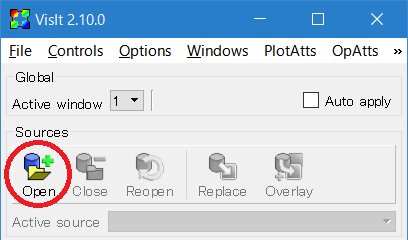
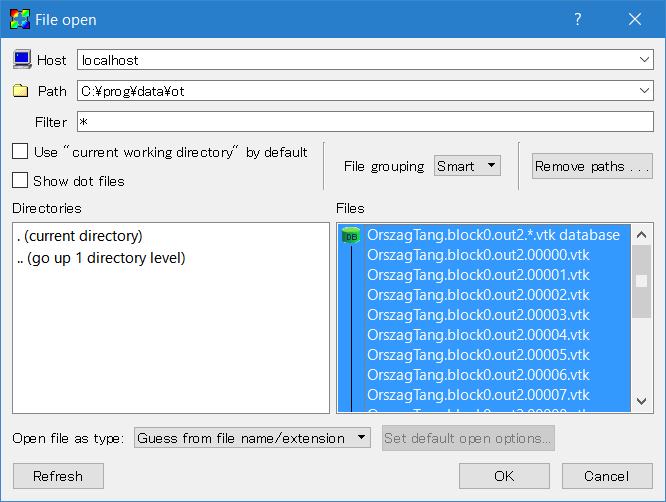
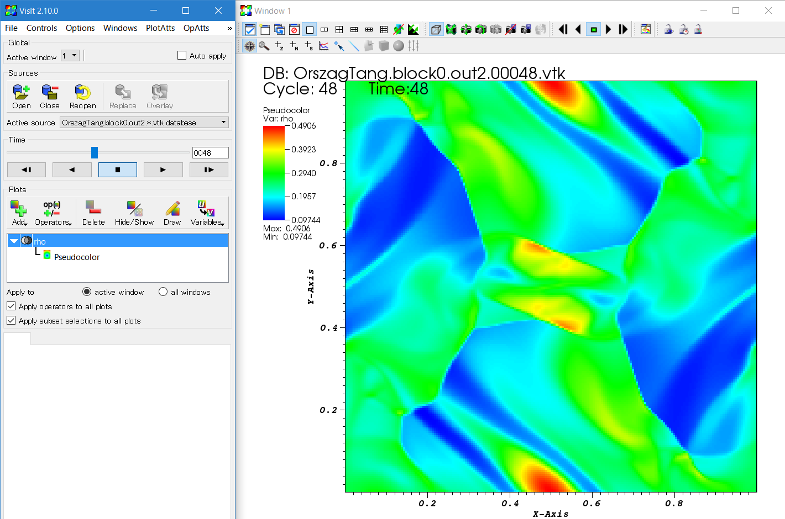
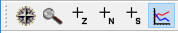
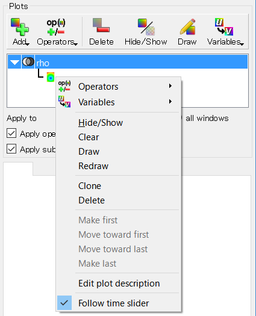
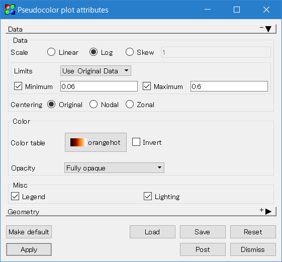
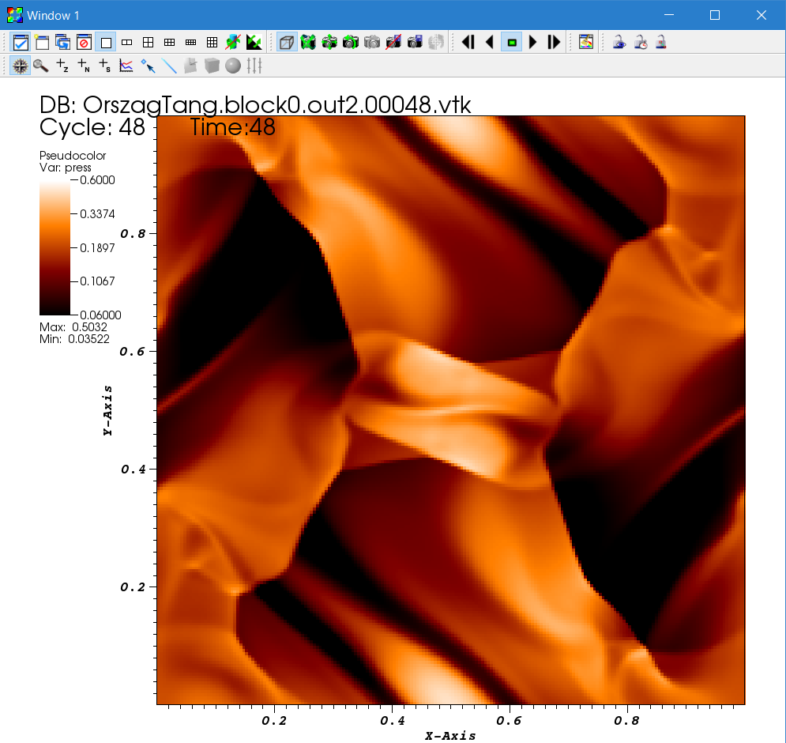

Let us move onto multi-dimensional problems. Here we take the Orszag-Tang vortex as a standard MHD test problem. To run this problem, follow these steps.

1\. Configure and build the code from the code root directory.

```
> python configure.py --prob orszag_tang -b --flux hlld
Your Athena++ distribution has now been configured with the following options:
  Problem generator:       orszag_tang
  Coordinate system:       cartesian
  Equation of state:       adiabatic
  Riemann solver:          hlld
  Reconstruction method:   plm
  Hydro integrator:        vl2
  Magnetic fields:         ON
  Special relativity:      OFF
  General relativity:      OFF
  Frame transformations:   OFF
  Viscosity:               OFF
  Compiler and flags:      g++  -O3
  Debug flags:             OFF
  Linker flags:
  MPI parallelism:         OFF
  OpenMP parallelism:      OFF
  HDF5 Output:             OFF
> make clean
> make
```

2\. Move into a working directory and copy the sample input file.
```
> cd ~/work
> cp ~/athena/inputs/mhd/athinput.orszag_tang .
```

3\. Run the simulation.
```
> ~/athena/bin/athena -i athinput.orszag-tang
RootGrid = 1 x 1 x 1
MeshBlock 0, rank = 0, lx1 = 0, lx2 = 0, lx3 = 0, level = 0
is=2 ie=201 x1min=0 x1max=1
js=2 je=201 x2min=0 x2max=1
ks=0 ke=0 x3min=-0.5 x3max=0.5

Setup complete, entering main loop...

cycle=0 time=0.00000000000000e+00 dt=9.03105842872373e-04
cycle=1 time=9.03105842872373e-04 dt=9.02542136923221e-04
...
cycle=1349 time=1.00000000000000e+00 dt=7.14611252872963e-04

Terminating on time limit
time=1.00000000000000e+00 cycle=1349
tlim=1.00000000000000e+00 nlim=-1

cpu time used  = 9.56800003051758e+01
zone-cycles/cpu_second = 5.63963187500000e+05
```
When it finishes, the code should have produced a large number of VTK output files.

4\. Visualize and analyze the results.

You can use your favorite visualization software that can read VTK files, but here we explain how to visualize the data using [[VisIt|https://wci.llnl.gov/simulation/computer-codes/visit/]] (2.10, released in October 2015). For details, see also [[Analysis Tools]].

4\.1\. Open the files with VisIt.

When launched, VisIt opens two windows, one for control and the other for output. First, click the "Open" button in the control window. (The images below are taken on Windows 10 but VisIt also runs on Linux and Mac, and provides the same user interface.)



VisIt automatically groups the files at different steps based on the file name. Select "OrszagTang.block0.out2.*.vtk database" and click "OK".



4\.2\. Add a Pseudocolor plot.

In VisIt, you can draw typical color map using the Pseudocolor plot. Select "Add → Pseudocolor → rho" to plot the gas density.


Then hit the "Draw" button on the control window. The result at the first step (i.e. the initial condition) is shown on the visualization window, but it is just all blue. Use the time slider or the buttons below to see the time evolution.



4\.3\. Manipulate the plot.

You can manipulate the plot interactively with VisIt.



Click the gear button and drag on the window to shift (or rotate in 3D) the plot. You can enlarge a region of interest using the magnifying glass button, or you can use your mouse wheel (or pinch on the pad). The graph icon (line out mode) enables you to show a 1D profile along a line you draw.

To change the variable, click the "Variables" button on the control window, or right-click the "Pseudocolor" icon and select from "Variables". For example, select "press" to plot the gas pressure.



You can change the plot attributes such as color range and color map by double-clicking the Pseudocolor icon. An example below is making a logarithmic plot with a fixed range from 0.06 to 0.6 using a dark-orange-white color map. Do not forget to press the "Apply" button after making a change.





If you want to make fancier plots or do more detailed analysis, please read the VisIt manual and tutorial.

---

[[Continue tutorial with Modifying the Input File|Modifying the Input File]]
