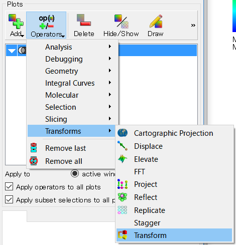
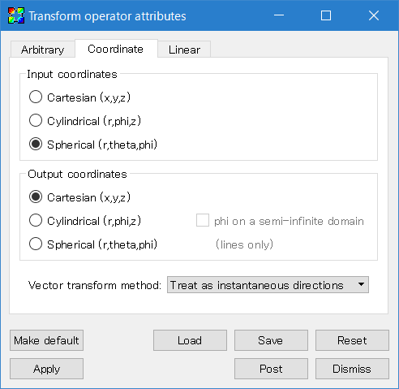
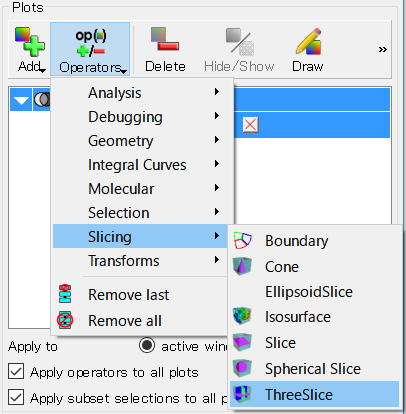
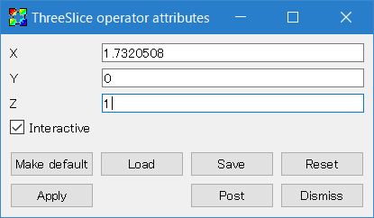
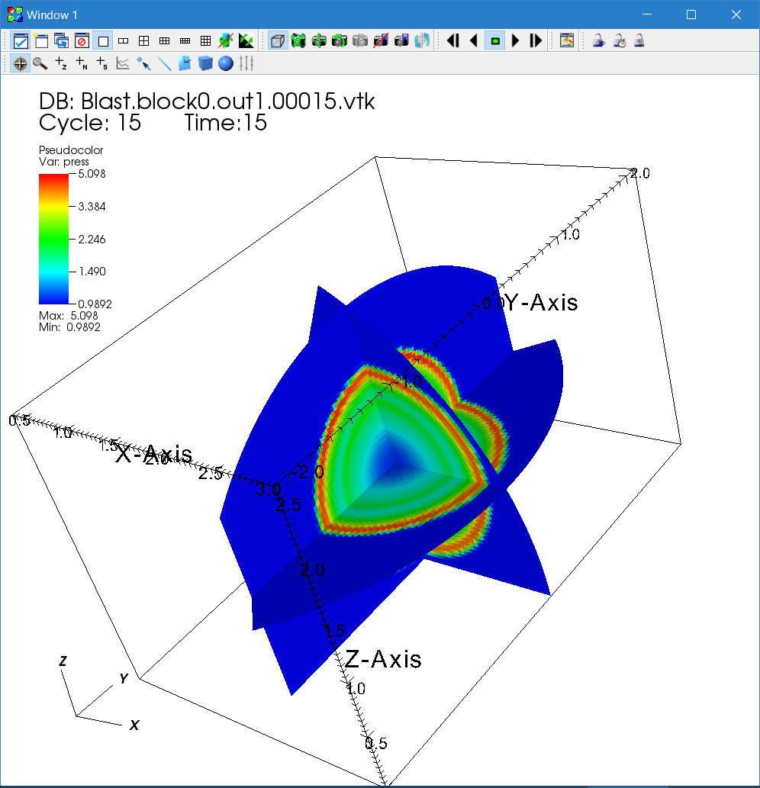

### Configuring the Code with Other Coordinate Systems
In order to activate cylindrical or spherical-polar coordinates, first the code must be configured with the `--coord` option. To see available coordinate systems, use `configure.py -h`.  For example, to run the blast wave test in spherical-polar coordinates:
```
    > python configure.py --prob blast --coord spherical_polar
```
The blast wave test (`blast.cpp`) can be run in either Cartesian, cylindrical, or spherical-polar coordinates. For your own problem generator, you have to write the initial condition and input file accordingly.

In cylindrical coordinates, x1 is <var>R</var>, x2 is <var>&#981;</var> (azimuthal angle), and x3 is <var>z</var>. In spherical polar coordinates, x1 is <var>r</var>, x2 is <var>&theta;</var> (polar angle), and x3 is <var>&#981;</var> (azimuthal angle). The volume-weighted center of a cell is given in the x?v arrays in the Coordinates class (you can access to them with `pcoord->x1v(i)` from the ProblemGenerator function). The position of the left cell surface is stored in the x?f arrays. When you need the arithmetic center of a cell rather than volume-weighted one (usually not), you can calculate it as `x1c = 0.5 * (pcoord->x1f(i) + pcoord->x1f(i+1))`. For an example, see `src/pgen/blast.cpp`.

After building the code, run it using the sample input file `inputs/hydro/athinput.blast_sph` (`athinput.blast_cyl` is for cylindrical coordinates):
```
    > ~/athena/bin/athena -i athinput.blast_sph
```
This problem is a part of the Athena++ test suite. It produces a spherical blast wave offset from the coordinate center and measures deformation. If the code is correct, the deformation should remain sufficiently small.

### Analysis
Again we demonstrate how to visualize the data using VisIt. As in the previous examples, open the VTK files and select the Pseudocolor plot of pressure. Since VisIt interprets the data as Cartesian by default, we need to convert the coordinates. This can be done using the Transform operator.



Click the triangle on the left of the Pseudocolor plot to open the operator list, and double click the "Transform" operator. Then move to the "Coordinate" tab, and select "Spherical" Input coordinates and "Cartesian" Output coordinates. Click "Apply", close the dialog window, and click the "Draw" button. You will see the data shown like (a part of) a sphere.



Next, add the ThreeSlice operator. By double clicking the operator from the list, you can change the position of each slicing plane. Do not forget to click the "Apply" button after changing the parameters. Then click the "Draw" button on the main window.





Finally you get the three dimensional sliced images of the blast wave. You can see the time evolution by using the "Time" bar. Also you can rotate the object by dragging or magnify it with the wheel (or you can use tools in the visualization window). The resulting image of the hydrodynamic blast wave problem with ambient pressure `problem/pamb=1.0` and ratio `problem/prat=100.` is shown below in logarithmic color scale using the default "hot" color table. 



---

[[Continue tutorial with SMR and AMR|SMR and AMR]]
