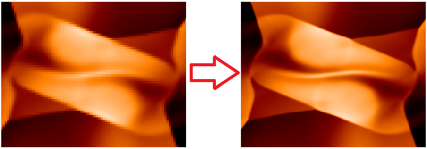

The previous two examples (the [[shock tube tests in 1D|1D Shock Tube]], and the [[Orszag-Tang vortex in 2D|2D Orszag Tang Vortex]]) used the default input files in the `/athena/inputs` directories. Suppose, however, one would like to change the grid resolution, or output files, or any other parameter of the runs. This is accomplished by editing the input files.

### Changing the Grid Resolution

The grid resolution used in the default 2D Orszag-Tang vortex test is not very high. Let us double the resolution.

1\. Edit the input file.

Because the input file is just a plain text file, you can modify it using standard text editors. It is recommended to create a new copy of the input file for each simulation.

    > cd ~/work
    > cp athinput.orszag_tang athinput.orszag_tang_high

Then open it with your favorite editor.
```
<mesh>
nx1        = 200       # Number of zones in X1-direction
x1min      = 0.0       # minimum value of X1
x1max      = 1.0       # maximum value of X1
ix1_bc     = periodic  # inner-X1 boundary flag
ox1_bc     = periodic  # outer-X1 boundary flag

nx2        = 200       # Number of zones in X2-direction
x2min      = 0.0       # minimum value of X2
x2max      = 1.0       # maximum value of X2
ix2_bc     = periodic  # inner-X2 boundary flag
ox2_bc     = periodic  # outer-X2 boundary flag
```
To increase the resolution, change nx1 and nx2.
```
<mesh>
nx1        = 400       # Number of zones in X1-direction
...
nx2        = 400       # Number of zones in X2-direction
```
You do not have to reconfigure or rebuild the code if you already have an executable binary configured for the Orszag-Tang problem. If not, reconfigure and make the code.

2\. Run the simulation using the new input file.
```
> ~/athena/bin/athena -i athinput.orszag_tang_high
RootGrid = 1 x 1 x 1
MeshBlock 0, rank = 0, lx1 = 0, lx2 = 0, lx3 = 0, level = 0
is=2 ie=401 x1min=0 x1max=1
js=2 je=401 x2min=0 x2max=1
ks=0 ke=0 x3min=-0.5 x3max=0.5

Setup complete, entering main loop...

cycle=0 time=0.00000000000000e+00 dt=4.51495485504003e-04
...
cycle=2774 time=1.00000000000000e+00 dt=3.40143584065472e-04

Terminating on time limit
time=1.00000000000000e+00 cycle=2774
tlim=1.00000000000000e+00 nlim=-1

cpu time used  = 8.07699951171875e+02
zone-cycles/cpu_second = 5.49511000000000e+05
```
3\. Visualize the result and compare it with the previous simulation.



### Adding New Outputs
Suppose you would like to output the data in the 2D Orszag-Tang vortex test not only in primitive variables but also in conservative variables. You need to add a new `<output>` block in the input file. Use the following steps.

1\. Add a new `<output>` block.

Open the input file and add another output block for conservative variables.

```
<output3>
file_type  = vtk       # VTK data dump
variable   = cons      # variables to be output
dt         = 0.01      # time increment between outputs
```

This will work but the default file names do not say what the output variable is. You can specify the output ID to change the file names.
```
<output2>
file_type  = vtk       # VTK data dump
variable   = prim      # variables to be output
id         = prim      # file ID
dt         = 0.01      # time increment between outputs

<output3>
file_type  = vtk       # VTK data dump
variable   = cons      # variables to be output
id         = cons      # file ID
dt         = 0.01      # time increment between outputs
```

2\. Run the simulation with the new input file.

The code will output `OrszagTang.block0.prim.?????.vtk` and `OrszagTang.block0.cons.?????.vtk` files.

---

[[Continue tutorial with Running 3D MHD with OpenMP and MPI|Running 3D MHD with OpenMP and MPI]]
