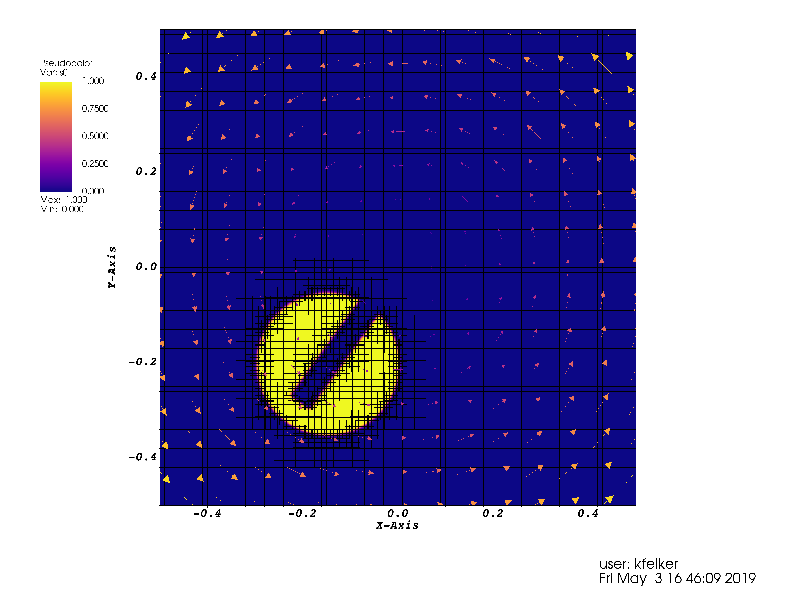
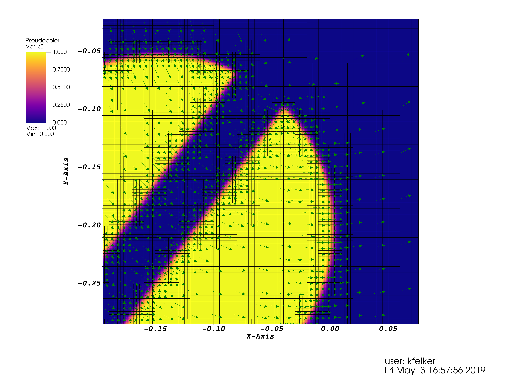

### Formulation 
A passive scalar is a quantity that is transported by the fluid but does not alter the fluid's behavior such as a tracer dye. Athena++ is capable of solving the following equation (in conservation form) for the evolution of any number of passive scalar **species** <var>i</var>:


where 


is the diffusive flux density of the <var>i</var>-th species, controlled by the passive scalar diffusion coefficient <var>&nu;</var><sub>ps</sub> (which must be equal for all species at this time). 

Similar to the hydrodynamic variables, our approach to solving this governing equation requires maintaining a dual representation of the cell-centered passive scalar fields. These representations are stored in 4D `AthenaArray` memory registers within the `PassiveScalars` object member of each `MeshBlock`.
- **Conservative variables:** the densities of each species = <var>&rho;</var> <var>C</var><sub>i</sub>. Stored in `PassiveScalars::s`.
- **Primitive variables**: the density-normalized, dimensionless fractions (also known as "concentrations") of each species = <var>C</var><sub>i</sub> in [0, 1]. Stored in `PassiveScalars::r`.

Variable floors are applied to these quantities during interface reconstruction and equation of state conversions to ensure that 1) the primitive `r` remains in [0, 1] and 2) the conservative `s` is consistent with `r` and the fluid density. 

**Note**: many applications (multimaterials, chemistry networks, etc.) may require that the sum of all concentrations <var>C</var><sub>i</sub> = 1 exactly everywhere in the domain for the lifetime of the simulation. Athena++ currently does **not** perform a renormalization step to ensure this constraint.

### Configuration and Problem Setup
To configure the code to evolve one or more species of passive scalars, run the `configure.py` script with `--nscalars=N`. This will set the internal preprocessor macro `NSCALARS` to `N`. See the [[Configuring]] page for more details. 

As mentioned within the [[Problem Generators]] page, if `NSCALARS > 0`, the required implementation of `void MeshBlock::ProblemGenerator(ParameterInput *pin)` must initialize the conservative formulation `AthenaArray<Real> PassiveScalar::s` of each type of passive scalar on every `MeshBlock`. The following code is an example created by modifying the function in `src/pgen/slotted_cylinder.cpp`:
```c++
void MeshBlock::ProblemGenerator(ParameterInput *pin) {
  AthenaArray<Real> vol(ncells1);
  Real d0 = 1.0;  // uniform fluid density across the mesh
  // initialize conserved variables
  for (int k=ks; k<=ke; k++) {
    for (int j=js; j<=je; j++) {
      pcoord->CellVolume(k, j, is, ie, vol);
      for (int i=is; i<=ie; i++) {
        // uniformly fill all scalars to have equal concentration
        constexpr int scalar_norm = NSCALARS > 0 ? NSCALARS : 1.0;
        if (NSCALARS > 0) {
          for (int n=0; n<NSCALARS; ++n) {
            pscalars->s(n,k,j,i) = d0*1.0/scalar_norm;
          }
        // ... initialize Hydro conserved variables
        }
      }
    }
  }
```
Another simple example of this initialization is provided in `src/pgen/shock_tube.cpp`.

### Compatibility with other code features 
- Passive scalars are automatically compatible with all of the built-in [[Boundary Conditions]] and their associated flags. As with the hydrodynamic variables, the boundary conditions are applied to the cell-centered primitive passive scalar quantities (dimensionless concentrations) and the conservative passive scalar variables (specieis densities) are automatically calculated from those updated values. However, [[User-Defined Boundary Conditions|Boundary-Conditions#user-defined-boundary-conditions]] are currently **unsupported** for `NSCALARS > 0` since there is no `AthenaArra<Real> &r` parameter in the function signature. We are planning on extending this feature soon.
- When `NSCALARS > 0`, the [[Outputs]] that specify either `cons` or `prim` variables will automatically include the conservative or primitive formulation of each passive scalar species, respectively. [[Restart Files|Outputs#restart-file]] for simulations with passive scalars automatically contain the conserved `s` data across the mesh.
- The treatment of passive scalars is also compatible with both [[Static Mesh Refinement]] (SMR) and [[Adaptive Mesh Refinement]] (AMR). For AMR, the user-provided `int RefinementCondition(MeshBlock *pmb)` function may be written to depend on the passive scalar variables stored within `pmb->pscalars`.
- [[Diffusion Processes]] are also supported for the passive scalars, and can be activated by setting a positive `problem/nu_scalar_iso` value in [[The Input File]] or when [[Overriding Input Parameters|Running-the-Code#overriding-input-parameters]]. 

### Example
```
> make clean; ./configure.py --prob=slotted_cylinder --eos=isothermal --nscalars=1 --nghost=4 -mpi -hdf5; make -j
> cd bin
> mpirun -n 8 ./athena -i ../inputs/hydro/athinput.slotted_cylinder2d_refined mesh/nx1=100 mesh/nx2=100 mesh/refinement=adaptive time/xorder=3 time/integrator=rk3
```

**Figure 1:** plot of the passive counter-clockwise advection of a 2D slotted cylinder scalar profile at `t=0.4` using RK3+PPM with AMR.


**Figure 2:** same result as shown in Figure 1 but zoomed-in near the sharp discontinuities around the slot. The gas velocity vector field is overlaid in a constant color. 


