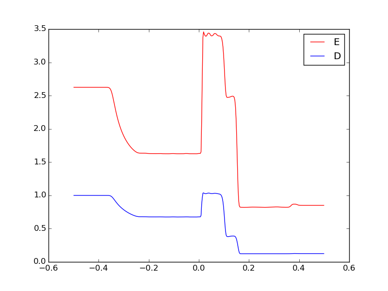
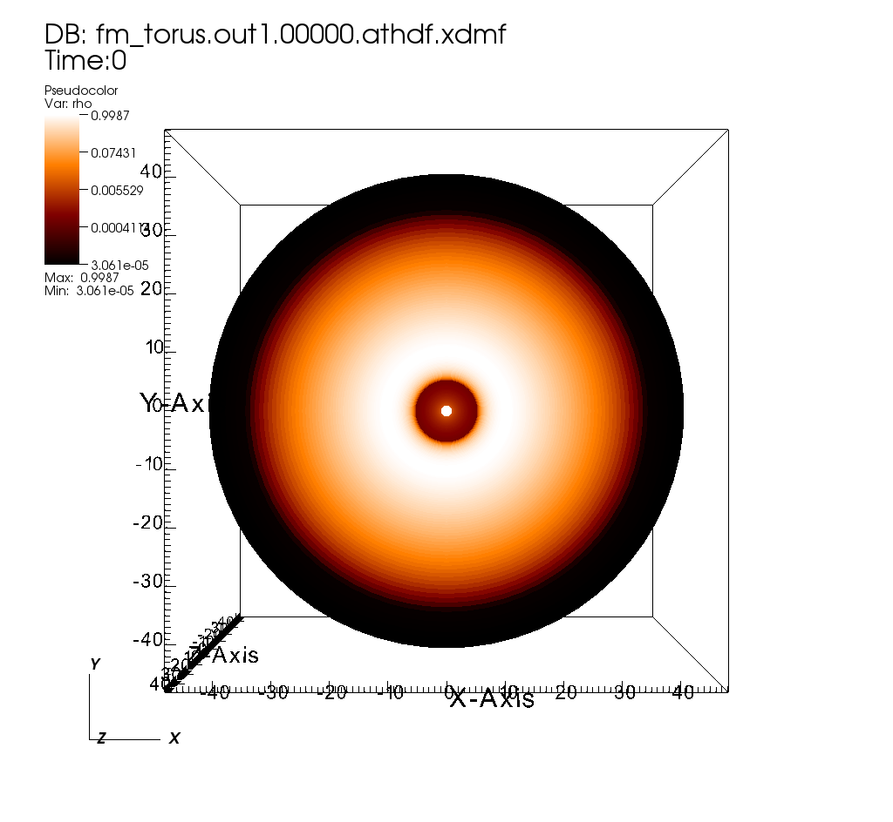
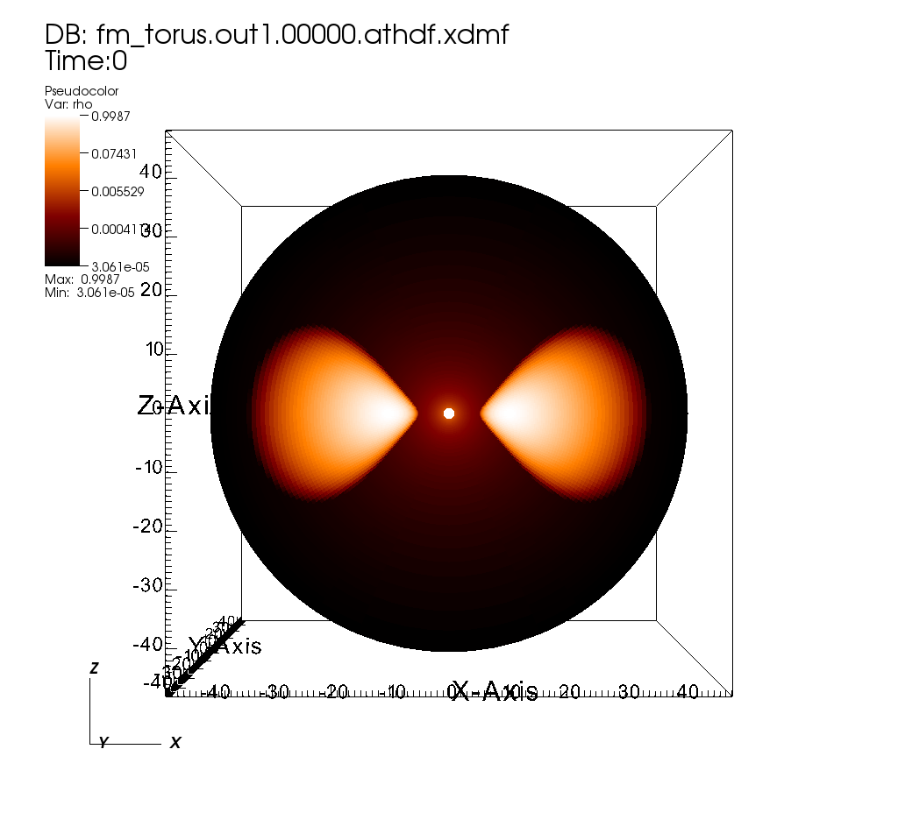

### Special Relativity (SR)

Special relativistic dynamics can be enabled with the `-s` configure option. For example, to compile the code for a relativistic MHD shock tube, we can use the following commands:
```
    > cd ~/athena
    > python configure.py -sb --prob gr_shock_tube --coord cartesian
    > make clean
    > make -j
```
Here we combine the `-s -b` flags into one to save on typing. Note that the plain "shock_tube" problem generator does not support relativity; the "gr_shock_tube" does however. We specify the default Cartesian coordinates for clarity. All coordinate systems that work for Newtonian dynamics work for SR as well. In fact, these are the only coordinates that can be used with SR. In particular, "Minkowski" coordinates are reserved for exercising the full machinery of general relativity (below) with a trivial metric. The `-s` flag changes the equation of state and Riemann solver to be compatible with relativity, but the rest of the code (time integrator, reconstruction algorithm, etc.) remains unchanged.

Now we can run the code. Several SR-specific input files are included in the repository. Here we will run one of the shock tubes from [[Mignone, Ugliano, & Bodo 2009|http://adsabs.harvard.edu/abs/2009MNRAS.393.1141M]].
```
    > cd ~/work
    > ~/athena/bin/athena -i ~/athena/inputs/mhd_sr/athinput.mub_1
```
As with the [[Newtonian shock tube example|1D Shock Tube]], this input file will produce .tab files. We can use the [[Python data reader|Reading Data into Python]] to read these files and plot the data:
```
    > python
    python> import sys
    python> import matplotlib.pyplot as plt
    python> sys.path.insert(0, '~/athena/vis/python')
    python> import athena_read
    python> data = athena_read.tab('MUBShock1.block0.out1.00001.tab')
    python> plt.plot(data[0,0,:,0], data[0,0,:,2], 'r-', label='E')
    python> plt.plot(data[0,0,:,0], data[0,0,:,1], 'b-', label='D')
    python> plt.legend()
    python> plt.show()
```



For more details, consult the full User Guide entry on [[Special Relativity]].

### General Relativity (GR)

General relativity can be enabled with the `-g` configure flag. This and `-s` are mutually exclusive. Like with SR, GR requires the code to use particular methods for the equation of state and Riemann problem. In addition, it requires specification of a metric (i.e. a coordinate system). The metric must be stationary. There are several options available, including Minkowski, Schwarzschild, and Kerr-Schild.

For a demonstration, we will set up a hydrodynamic equilibrium torus around a spinning black hole as per [[Fishbone & Moncrief 1976|http://adsabs.harvard.edu/abs/1976ApJ...207..962F]], seeded with a weak magnetic field. Because general-relativistic problems are very often global problems in spherical-like coordinates, mesh refinement is critical to performance if one wishes to resolve the equatorial plane. Here we will employ static mesh refinement, and therefore HDF5 output. (See also the [[tutorial on mesh refinement|SMR and AMR]].)

First we configure and compile the code.
```
    > cd ~/athena
    > python configure.py -gtb --prob gr_torus --coord kerr-schild --flux hlle -hdf5
    > make clean
    > make -j
```
Note the GR (`-g`) and MHD (`-b`) flags. We also include `-t`, which performs a frame transformation at each Riemann problem, allowing the use of advanced SR-enabled Riemann solvers. This does not matter for the choice of HLLE, but one can easily change the above configuration from HLLE to HLLD. Here we specify the spherical-like Kerr-Schild coordinates, which describe Kerr spacetime. We omit MPI for simplicity, but in practice one will need many processes to evolve such a global simulation.

Next we modify an input file and run the code just far enough for it to output the initial conditions.

    > cd ~/work
    > cp ~/athena/inputs/mhd_gr/athinput.fm_torus .

`athinput.fm_torus` is set up for a basic 3D torus at low resolution. We will modify the file to set up a slightly more interesting simulation. We can remove the `<output2>` and `<output3>` blocks entirely, in order to reduce the number of files written in this example. Change the limit on the number of cycles to 0:

    <time>
    ...
    nlim = 0
    ...

Also adjust the Mesh parameters, enabling refinement, as well as the sizes of MeshBlocks:

```
<mesh>
nx1    = 40
x1min  = 1.0783882181415012
x1max  = 48.0
x1rat  = 1.0995415683341665
...
nx2    = 32
...
nx3    = 16
...
refinement = static

<meshblock>
nx1 = 20
nx2 = 4
nx3 = 16
```

MeshBlocks that are very thin in the theta-direction are often necessary in order to de-refine near the poles and keep the timestep large. We must also specify some refinement criterion. Add the following to the input file:
```
    <refinement1>
    level = 2
    x1min = 1.0783882181415012
    x1max = 48.0
    x2min = 0.6872233929727672
    x2max = 2.454369260617026
    x3min = 0.0
    x3max = 6.283185307179586
```
These values are chosen to create two levels of refinement while still keeping the poles at the root level. Finally, we can easily add spin to the black hole by modifying the `a` coordinate parameter:
```
    <coord>
    ...
    a = 0.9375
```
We can now run the code:
```
    > ~/athena/bin/athena -i athinput.fm_torus
```
Even though there are 660 MeshBlocks, we are not taking any timesteps, and so the code can run on 1 core in a few seconds.

There should now be two output files, `fm_torus.prim.00000.athdf` and `fm_torus.prim.00000.athdf.xdmf`. The data is in the former, while the latter is used by VisIt to read the former.

The data can be visualized with VisIt as follows:

  - Open `fm_torus.prim.00000.athdf.xdmf`
  - Click Add → Pseudocolor → rho
  - Click the right-triangle next to "Pseudocolor" to expand the list
  - Click Operators → Transforms → Transform
  - Click Operators → Slicing → ThreeSlice
  - Double click "Transfom" in the expanded list
    - In the "Coordinate" tab select "Spherical" for Input and "Cartesian" for Output
    - Apply and Dismiss the Transform window
  - Double click "Pseudocolor" in the expanded list
    - Select "Log" for Scale
    - Select "orangehot" for Color table
    - Apply and Dismiss the Pseudocolor window
  - Click "Draw"

This should result in the following top-down view of the equatorial plane:



In order to see a side-on view, go to "Controls → View" and set the View normal to "0 -1 0" and the Up Vector to "0 0 1". Click "Apply" and the new image should be as shown:



For more details, consult the full User Guide entry on [[General Relativity]].
