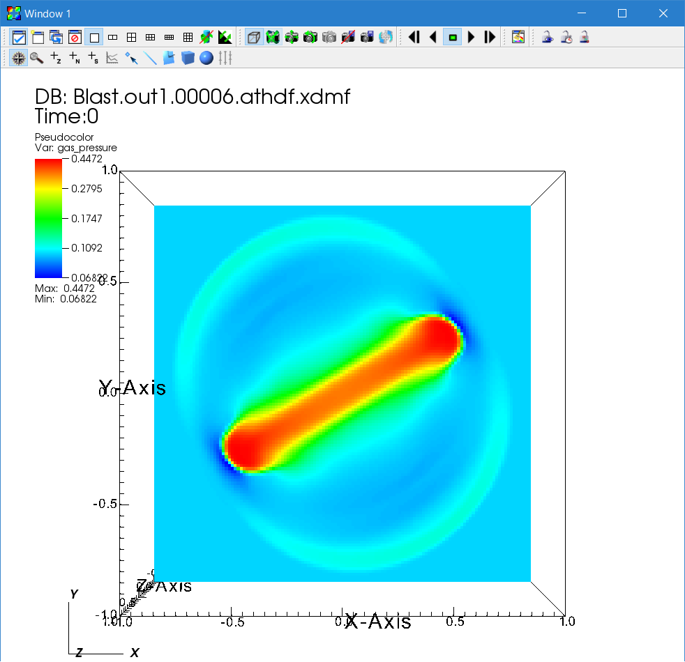
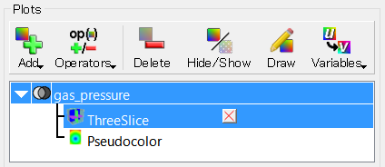
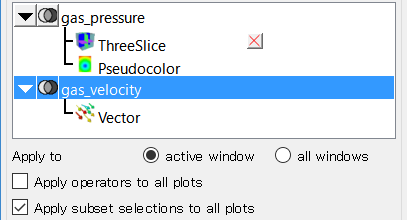
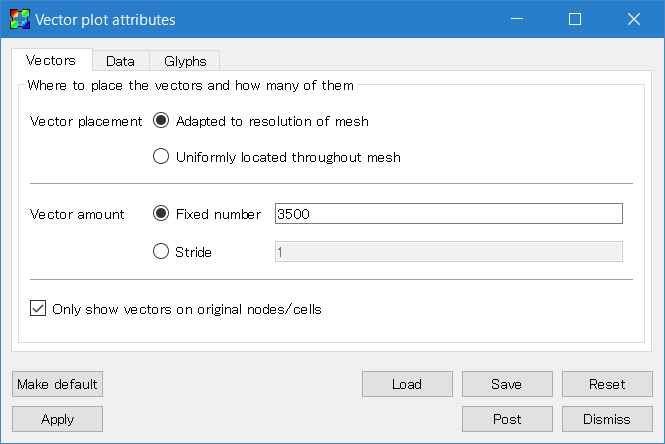
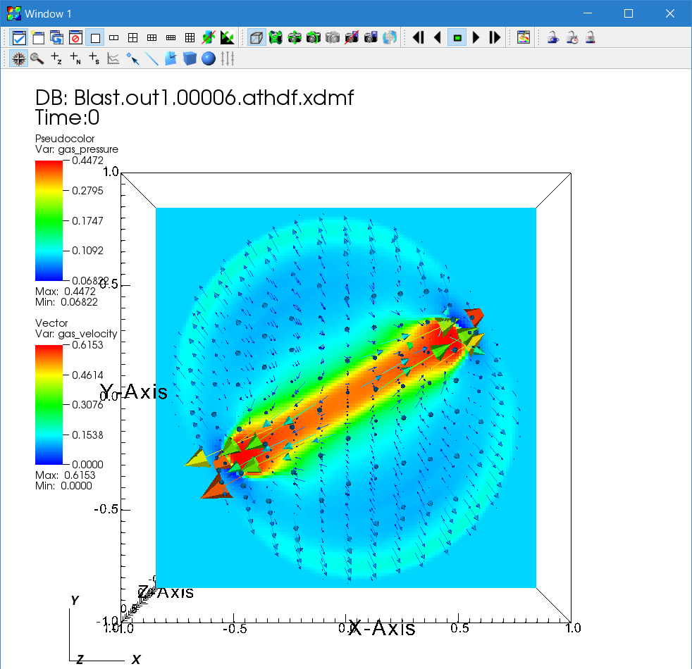
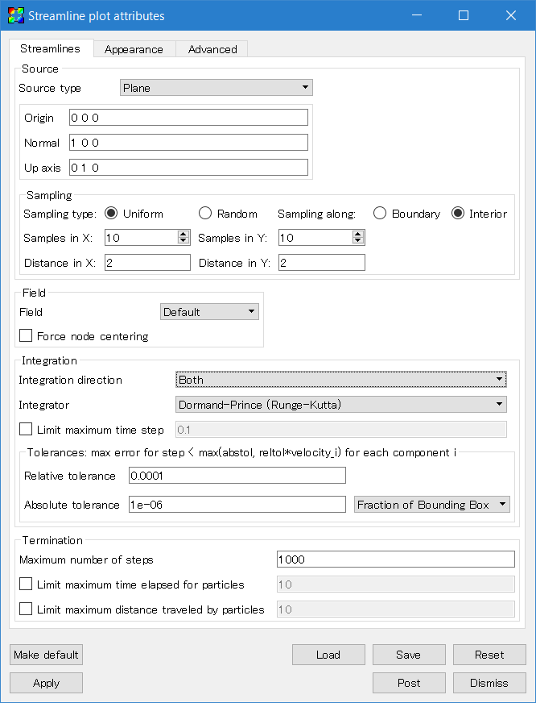
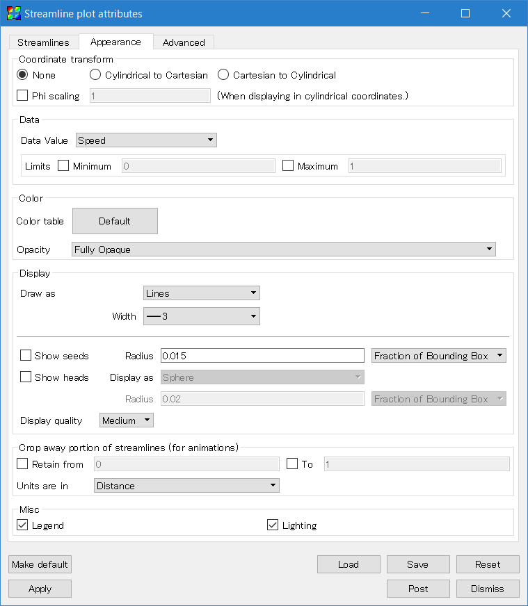
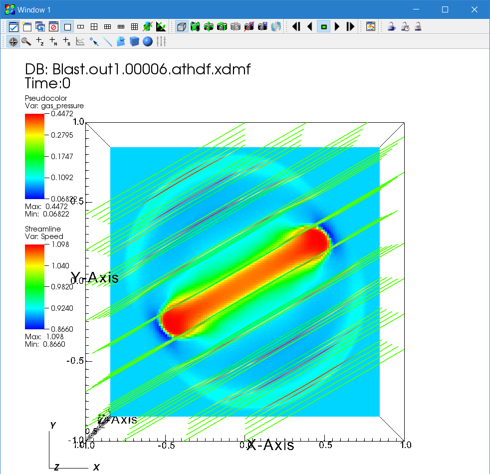

### Parallel Simulations with Athena++
Now let us move onto more practical simulations. In order to run larger simulations, parallelization is required. Athena++ is parallelized in two ways: shared-memory parallelization using OpenMP and distributed-memory parallelization using MPI. Hybrid parallelization mixing both is also possible. In this chapter, you will learn how to run parallel simulations. We do not cover how to set up the environment for parallel simulations; please consult your system administrator for that.

### MPI Parallelization
OpenMP parallelization is shared-memory parallelization, which usually works only within one computing node. For larger simulations, distributed-memory parallelization is required. Message Passing Interface (MPI) is a de facto standard for this. To use MPI, you need to have MPI installed on your system. Most cluster systems at universities or supercomputers should have it, but sometimes you need to load modules. Please refer to the documentation for your system. Installation of MPI is beyond this tutorial.

There are many variants of MPI, but most of them should work. Here we assume the name of the MPI C++ compiler is `mpicxx`, but please replace it accordingly.

Here we also explain how to use the HDF5 output, which is convenient for parallel simulations.

1a\. Configure and compile the code with the `-mpi` switch.
```
> cd ~/athena
> python configure.py --prob blast -b --flux hlld -mpi
Your Athena++ distribution has now been configured with the following options:
  Problem generator:       blast
  Coordinate system:       cartesian
  Equation of state:       adiabatic
  Riemann solver:          hlld
  Reconstruction method:   plm
  Hydro integrator:        vl2
  Magnetic fields:         ON
  Special relativity:      OFF
  General relativity:      OFF
  Frame transformations:   OFF
  Viscosity:               OFF
  Compiler and flags:      mpicxx  -O3
  Debug flags:             OFF
  Linker flags:              -lhdf5
  MPI parallelism:         ON
  OpenMP parallelism:      OFF
  HDF5 Output:             ON
> make clean
> make
```

1b\. Configure and compile the code with MPI and HDF5 (optional but recommended).

If you have the HDF5 library (a parallel version is often called pHDF5) installed on your system, you can use HDF5 output. To enable this, configure the code with `-hdf5` option. The code assumes that the library name is `libhdf5`. If not, you need to edit the Makefile (see [[Compiling]]).
```
> python configure.py --prob blast -b --flux hlld -mpi -hdf5
> make clean
> make
```

2\. Edit the input file to set up domain decomposition.
Let us use the 3D MHD blast wave test as an example. First, comment out the `num_threads` parameter (this is not needed, but is done just to avoid confusion).
```
<mesh>
...
#num_threads = 4         # Number of OpenMP threads per process
```
Then, specify the size of decomposition unit, MeshBlock. The root grid size is:
```
<mesh>
nx1        = 64         # Number of zones in X1-direction
nx2        = 64         # Number of zones in X2-direction
nx3        = 64         # Number of zones in X3-direction
```
To decompose this domain into blocks of 32<sup>3</sup> cells, add the following output block after the `<mesh>` block (actually, anywhere is OK) in the input file.

```
<meshblock>
nx1        = 32         # Number of zones per MeshBlock in X1-direction
nx2        = 32         # Number of zones per MeshBlock in X2-direction
nx3        = 32         # Number of zones per MeshBlock in X3-direction
```
This produces a grid with 2×2×2 = 8 total MeshBlocks. Obviously, the root grid must be evenly divisible by the MeshBlock size. Each MPI process can work on one or more MeshBlocks, and the number of MeshBlocks per process is not necessarily equal although this is recommended. Therefore, in this configuration, you can use up to 8 processes. If you want to run larger simulations, you can increase the root grid size. For example, if you want to double the resolution and use 64 processes, modify the input file like so:
```
<mesh>
nx1        = 128        # Number of zones in X1-direction
nx2        = 128        # Number of zones in X2-direction
nx3        = 128        # Number of zones in X3-direction

<meshblock>
nx1        = 32         # Number of zones per MeshBlock in X1-direction
nx2        = 32         # Number of zones per MeshBlock in X2-direction
nx3        = 32         # Number of zones per MeshBlock in X3-direction
```

The problem size used here is relatively small because this is a part of tutorial and we want to get results quickly. For better performance, it is recommended to use somewhat larger MeshBlocks. For typical Intel processors with Advanced Vector Instructions (AVX) SIMD support (like 2.5GHz Haswell Xeon), about 64<sup>3</sup> cells per core (either process or thread) is recommended, but the optimal block size depends on problems and computers (and your tolerance). It is the responsibility of users to use the code and computers efficiently!

(optional) If you configured the code with the HDF5 option, change the output format to HDF5.
```
<output1>
file_type  = hdf5       # HDF5 data dump
variable   = prim       # variables to be output
dt         = 0.1        # time increment between outputs
```

3\. Run the simulation with MPI.

How to launch an MPI program depends on the system, so please consult your system's documentation. On clusters and supercomputers typically job scheduling software such as PBS and Slurm is used, and you need a job script to submit a job. Please note that we do not have sufficient manpower to support any machine-specific problem. To start an MPI program, usually the `mpiexec` command is used. Depending on the system, it can be `mpirun`, `aprun`, etc. In order to launch a parallel simulation using 8 cores, use
```
    > mpiexec -n 8 ~/athena/bin/athena -i athinput.blast > log
```
The standard output is redirected into a file named "log".

4\. Join VTK files (for VTK output).

When VTK output is specified, one file per MeshBlock is created at every output. For your convenience, the `join_vtk++` program is provided in the `vis/vtk` directory. This program combines VTK files into one big VTK file. You can compile it with
```
    > gcc -o join_vtk++ join_vtk++.cpp -lm
```
and use it as follows:
```
    > join_vtk++ -o Blast.00000.vtk Blast.block0.out1.00000.vtk Blast.block1.out1.00000.vtk ...
```
5\. Visualization is covered in the final section.

### OpenMP Parallelization
OpenMP is directive-based parallelization, and it can parallelize within a computing node. It is supported by many compilers without installing special software. Let us take a 3D MHD blast wave as in the previous section.

1\. Configure and compile the code with the `-omp` switch.
```
> cd ~/athena
> python configure.py --prob blast -b --flux hlld -omp
Your Athena++ distribution has now been configured with the following options:
  Problem generator:       blast
  Coordinate system:       cartesian
  Equation of state:       adiabatic
  Riemann solver:          hlld
  Reconstruction method:   plm
  Hydro integrator:        vl2
  Magnetic fields:         ON
  Special relativity:      OFF
  General relativity:      OFF
  Frame transformations:   OFF
  Viscosity:               OFF
  Compiler and flags:      g++  -O3 -fopenmp
  Debug flags:             OFF
  Linker flags:
  MPI parallelism:         OFF
  OpenMP parallelism:      ON
  HDF5 Output:             OFF
```

2\. Move to a working directory and copy the sample input file.
```
> cd ~/work
> cp ~/athena/inputs/mhd/athinput.blast .
```

3\. Edit the input file to set the domain decomposition and the number of OpenMP threads per process.

We use the same domain decomposition for OpenMP parallelization as in the MPI case. You have to decompose the computing domain into smaller units called MeshBlocks.
```
<mesh>
nx1        = 64         # Number of zones in X1-direction
...
nx2        = 64         # Number of zones in X2-direction
...
nx3        = 64         # Number of zones in X3-direction
...
num_threads = 4         # Number of OpenMP threads per process

<meshblock>
nx1        = 64         # Number of zones in X1-direction per MeshBlock
nx2        = 32         # Number of zones in X2-direction per MeshBlock
nx3        = 32         # Number of zones in X3-direction per MeshBlock
```
In this example, the root grid size is 64^3 and 4 MeshBlock with 64x32x32 cells will be created. Also this example specifies 4 threads to be launched. Note that the number of MeshBlocks must be equal to or larger than the number of the threads. The best number of threads for OpenMP parallelization depends on the system and the size of the problem. Note that the problem size in this input file is relatively small.

4\. Run the simulation as usual.
```
    > ~/athena/bin/athena -i athinput.blast
```
5\. Visualize the result.

In this run, the code creates one VTK file per output time step per MeshBlock. You can combine the data into a single file using the HDF5 output. Visualization of 3D data is the same as the MPI case, and is explained at the end of this page.

6\. Compare the performance by changing the number of threads

At the end of the simulation, the code shows the time and performance achieved in the run.
```
cpu time used  = 2.86014892578125e+02
zone-cycles/cpu_second = 2.97875406250000e+05

omp wtime used = 7.46549757500034e+01
zone-cycles/omp_wsecond = 1.14120725000000e+06
```
The "omp wtime" is the actual wall-clock time spent, and the cpu time is the total CPU time. So the ratio between these numbers is the speed-up achieved by the OpenMP parallelization. You need to compare these numbers and adjust it to obtain the best result. Again, how many threads per process (MPI rank) should be used depends on the system. We will come back to this issue later.

### Hybrid Simulation (advanced users)
OpenMP and MPI are different ways of parallelization, but in Athena++ we use both parallelization methods similarly to parallelize over MeshBlocks. This coarse-grained threading gives better performance as it requires less synchronization compared to commonly-used loop-based threading.

You can mix OpenMP and MPI. However, it is not trivial to achieve the maximum performance. On typical Intel processors (e.g. 2.5GHz Haswell Xeon), generally you should have at least 32<sup>3</sup> cells and preferably 64<sup>3</sup> cells per physical core for MHD simulations. Then you can launch 2 or 4 (or possibly 8) threads per process. The total number of threads per node should match with the number of *physical* cores per node (i.e., do not count "virtual/logical cores" used in hyperthreading). For example, if there are 24 physical cores per node, you can run your program with 24 processes (flat MPI), 2 threads × 12 processes, 4 threads × 6 processes, or even 24 threads × 1 process (not recommended) per node. The best balance depends on problems and systems. For simplicity, we suggest starting with flat MPI parallelization (i.e., MPI only, without OpenMP).

Note that, if you are using Intel Xeon Phi (Knights Landing) or IBM BlueGene/Q, its CPU design is different from Intel Xeon. Therefore, you can and should use 4 (or 2) threads (or MPI processes) per physical core.

For example, suppose you want to run a simulation on a cluster that has 16 cores per node, and you want to use 16 nodes (256 cores), using 4 threads × 4 processes per node (64 processes in total). This can be done as follows:

1\. Configure and compile the code with both `-omp` and `-mpi` flags.
```
> cd ~/athena
> python configure.py --prob blast -b --flux hlld -omp -mpi -hdf5
> make clean
> make
```
(It is highly recommended to use the HDF5 output for large simulations.)

2\. Edit the input file
```
<mesh>
nx1        = 256        # Number of zones in X1-direction
nx2        = 256        # Number of zones in X2-direction
nx3        = 256        # Number of zones in X3-direction
...
num_threads = 4         # Number of OpenMP threads per process

<meshblock>
nx1        = 64         # Number of zones per MeshBlock in X1-direction
nx2        = 32         # Number of zones per MeshBlock in X2-direction
nx3        = 32         # Number of zones per MeshBlock in X3-direction
```
This will produce a grid with 4×8×8 = 256 total MeshBlocks. Each process will own 4 MeshBlocks, and each thread processes one MeshBlock.

3\. Launch the program.

You need to tell the system how to map the processes to the computing nodes. This should be explained in your system's documentation. For OpenMPI, this can be done with `-map-by ppr:4:node` (if there are two sockets, this should be `ppr:2:socket`):
```
    > mpiexec -n 64 --map-by ppr:4:node ~/athena/bin/athena -i athinput.blast > log
```
### Visualization of 3D MHD data
Visualization of 3D data is slightly more complicated. Here again we take VisIt as an example.

1\. Load the data.

If you are using the VTK format, open the `*.vtk` database. If you are using the HDF5 format, open `*.athdf.xdmf` files, not `*.athdf` files. VisIt does not know how to read the Athena++ HDF5 format directly; the XDMF file serves as an interface.

2\. Load the expression file (only for HDF5).

The HDF5 format stores all the data as scalar variables. Using VisIt's Expressions we can construct useful variables. On the control window's menu, click "Controls → Expressions". Then click the "Load" button and open `athena/vis/visit/athdf_MHD_primitive.xml`. Close the window.

3\. Add a pseudocolor plot and a slicing operator.

First, let us see the gas pressure distribution. Click "Add → Pseudocolor → gas_pressure" then "Draw". You see only a blue box, because only the surface of the computational domain is shown. To see the inside, there are many different ways. You can add operators to manipulate the plots. Click "Operators → Slicing → ThreeSlice" then "Draw". Sliced pseudocolor maps on X-, Y-, and Z-planes are shown. You can drag on the visualization window to rotate the plot. Use the time slider to see the time evolution. Below, the pressure solution at `t=0.6` on a 128×128×128 cell grid is shown in logarithmic scale using the default "hot" color table.



To change the parameters of an operator, click the triangle next to the "Pseudocolor" icon. The list of operators will be expanded. Then double click the "ThreeSlice" operator to change the parameters. You can remove an operator by clicking the "X" icon. When there are multiple operators, you can change the ordering by clicking the triangles on the right side.



4\. Velocity vectors.

You can overlay many plots using VisIt. Using this feature, let us add the velocity vectors to see the flow. By default VisIt applies operators to all the plots; this is convenient in some situations but for now disable this by unchecking "Apply operators to all plots". Then add "Add → Vectors → gas_velocity".



Next double click the "Vector" icon to open the window to set the attributes. Increase the number of vectors, and adjust the glyph size by changing the scale in the "Glyphs" tab. Also the vector origin should be set to middle.



Then go back to the Control window and click "Draw". Adjust parameters to make a beautiful plot.



5\. Magnetic field lines.

Another important analysis tool is visualizing the magnetic field lines. A streamline plot is used for this purpose, but the precise steps for creating such a plot in VisIt depends on which version you are using. Note, the `athdf_MHD_primitive.xml` expressions mentioned above must be loaded in order to have the "bfield" quantity and "IntegralCurve" operator option available. 

*For VisIt versions 2.11.0 (August 2016) and later*, the magnetic field lines can be plotted using the IntegralCurve operator applied to a Pseudocolor plot. Click "Add" then follow "operators", "IntegralCurve", "bfield" to add the plot. Open the operator list and double-click the IntegralCurve icon to change the parameters. Field lines are calculated by integrating the vector fields along the lines from starting points. So first we need to specify the starting points. For example, set the source type to "Plane", then set "Normal" to "1 0 0" (adjust these parameters to tweak the plot). Then increase "Samples" to 10, both X and Y. This means it will draw 10x10=100 field lines. Then set the X and Y "Distance" to 2.0 to cover the whole computational domain. Lastly, change the "Integration direction" (the direction from the starting points to integrate) to "Both".

*For VisIt versions before 2.11.0*, select "Add → Streamline → bfield" and double click the "Streamline" icon. A number of settings require adjusting. First, specify the source (a set of integration starting points) in the "Streamlines" tab. Select source type "Plane", and set "Normal" to "1 0 0". This setting is specific to this problem and needs to be changed for each problem. Then increase the samples in X and Y to 10. Set the distances both in X and Y to 2.0 to cover the whole domain. Also change the integration direction to "Both".

The below menu screenshots are from a VisIt version before 2.11.0. Refer to the [February 2018 version of the tutorial](http://astro-osaka.jp/tomida/athena_eng/3dmhd.html) for comparable screenshots from VisIt 2.12.1.



**Note:** There is a known bug that may occur when applying the streamline integrator in VisIt to Athena++ outputs with multiple MeshBlocks. If the integrator's source lies on a MeshBlock boundary (`x=0.0` here), it is possible that the integration steps get "stuck in the gap" between two MeshBlocks. In such a case, the resulting streamlines might not extend in either or both directions from the source. There are two possible workarounds. First, you can perturb the source point slightly, say to `x=0.00001` in this example, so that the integrator "skips over" the the MeshBlock boundary gap. Or, data from the MeshBlock's ghost zones can be added to the output file via `output1/ghost_zones=1` to "fill in the gap".

Second, go to the "Appearance" tab. Change "Data Value" to "Speed" to visualize the amplitude, or set it to "Solid" to use a single color. You can select your favorite color table. Finally, uncheck the "Show seeds" box. Do not forget to click the "Apply" button.



Go back to the Control window and click "Draw".



Interpretation of the time evolution of the streamlines requires caution. The motion of these streamlines does *NOT* trace the time evolution of actual magnetic field lines because the source locations are fixed. In other words, it shows streamlines corresponding to different field lines every time step.

---

[[Continue tutorial with Cylindrical and Spherical Polar Coordinates|Cylindrical and Spherical Polar Coordinates]]
