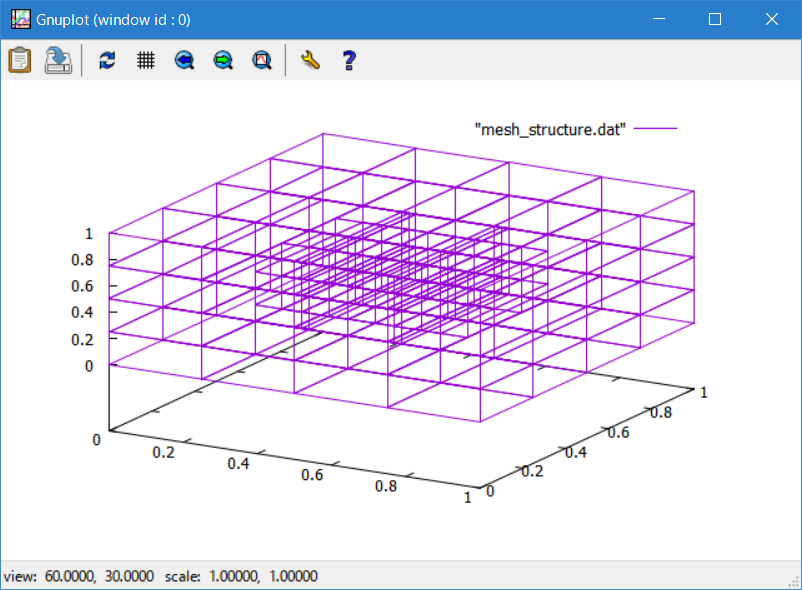
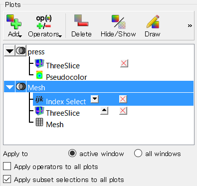
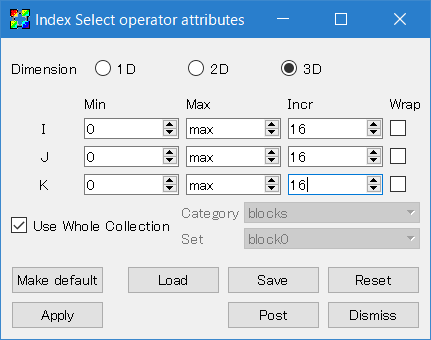
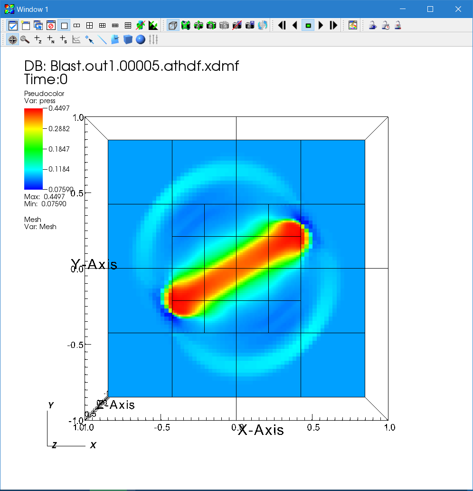
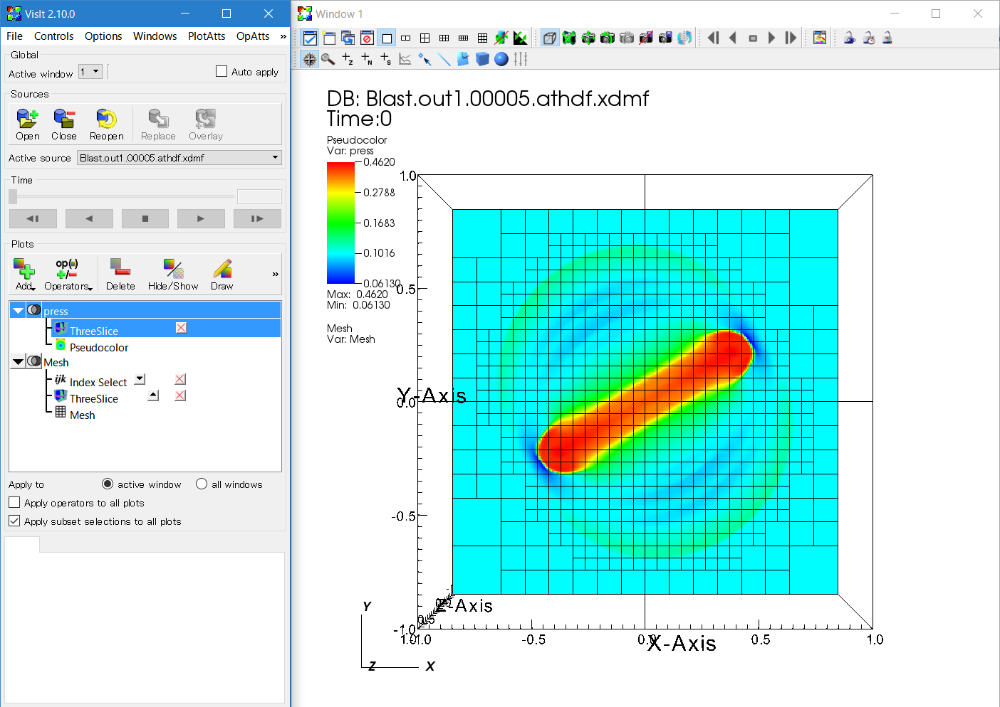
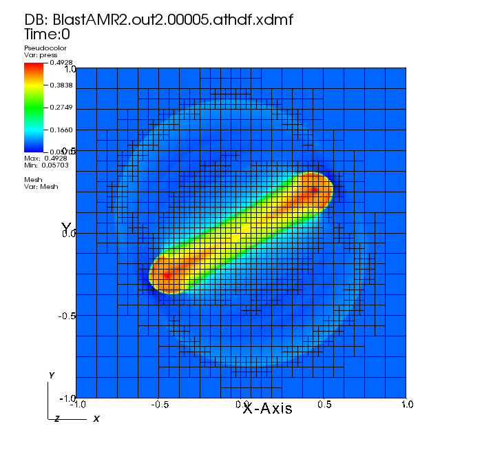

### Static Mesh Refinement
Static Mesh Refinement means that some regions of the computational domain are covered by finer grids but they are fixed and not adaptive. This is not as flexible as AMR, but it is faster (and easier to analyze) than AMR and is often useful enough in problems in astrophysics. We recommend using SMR instead of AMR if the regions of interest are known in advance. For the details of the grid structure, see [[Static Mesh Refinement]].

Let us go back to [[the blast wave test in Cartesian coordinates|Running 3D MHD with OpenMP and MPI]] again, and say we want to resolve the region near the center of the explosion. (Note: This is just an example and not physically motivated - you probably want to resolve the shock front. See below for such applications with AMR.)

First of all, because SMR involves a complicated grid structure, HDF5 output is strongly recommended. To configure the code with HDF5,
```
    > python configure.py --prob blast --flux hlld -b -hdf5
```
This configuration includes magnetic fields. To enable MPI parallelization, simply add the `-mpi` option. Note that no additional option is required for SMR and AMR.

Let us place grids near the center where the explosion occurs. First, you have to set the `<mesh>` `refinement` flag to `static` in the input file. Then the computational domain must be decomposed into smaller MeshBlocks, because a MeshBlock is the unit of refinement. As smaller MeshBlocks are more flexible but computationally inefficient, the size of Meshblocks must be set carefully. The following example produces a root grid of 64<sup>3</sup> cells and MeshBlocks with 16<sup>3</sup> cells:
```
...
<mesh>
nx1        = 64         # Number of zones in X1-direction
x1min      = -1.0       # minimum value of X1
x1max      =  1.0       # maximum value of X1
ix1_bc     = periodic   # inner-X1 boundary flag
ox1_bc     = periodic   # outer-X1 boundary flag

nx2        = 64         # Number of zones in X2-direction
x2min      = -1.0       # minimum value of X2
x2max      =  1.0       # maximum value of X2
ix2_bc     = periodic   # inner-X2 boundary flag
ox2_bc     = periodic   # outer-X2 boundary flag

nx3        = 64         # Number of zones in X3-direction
x3min      = -1.0       # minimum value of X3
x3max      =  1.0       # maximum value of X3
ix3_bc     = periodic   # inner-X3 boundary flag
ox3_bc     = periodic   # outer-X3 boundary flag

num_threads = 1         # Number of OpenMP threads per process
refinement = static

<meshblock>
nx1    =  16
nx2    =  16
nx3    =  16
...
```
Then we have to specify regions to be refined. In order to get double resolution near the center, add the following block:

    <refinement1>
    x1min=-0.5
    x1max= 0.5
    x2min=-0.5
    x2max= 0.5
    x3min=-0.5
    x3max= 0.5
    level=1

You can add more blocks like `refinement2`, `refinement3`, ... It is OK for the refinement regions to overlap each other - the code generates the minimally refined grid satisfying all the conditions. If you want to get even higher resolution, simply set a higher `level`.

Before actually running the simulation, it is highly recommended to check the grid structure by running the code with the `-m` option.
```
> ~/athena/bin/athena -i athinput.example -m 1
Root grid = 4 x 4 x 4 MeshBlocks
Total number of MeshBlocks = 120
Number of physical refinement levels = 1
Number of logical  refinement levels = 3
  Physical level = 0 (logical level = 2): 56 MeshBlocks, cost = 56
  Physical level = 1 (logical level = 3): 64 MeshBlocks, cost = 64
Number of parallel ranks = 1
  Rank = 0: 120 MeshBlocks, cost = 120
Load Balancing:
  Minimum cost = 1, Maximum cost = 1, Average cost = 1

See the 'mesh_structure.dat' file for a complete list of MeshBlocks.
Use 'python ../vis/python/plot_mesh.py' or gnuplot to visualize the mesh structure.
```
This outputs statistics about MeshBlocks created, as well as load balance if you specify the number of processes you want to use (replace the `1` in `-m 1`). This option also generates "mesh_structure.dat", which can be read using gnuplot.
```
    > gnuplot
    > splot "mesh_structure.dat" w l
```


Please note that even though there are 4<sup>3</sup> MeshBlocks in the root level and 4<sup>3</sup> MeshBlocks in the refined level, the total number of MeshBlocks is actually 120. This is because Athena++ does not solve overlapping MeshBlocks, and replaces one coarse MeshBlock with 8 (in 3D, 4 in 2D) fine MeshBlocks. This often results in a strange number (not power of 2) of MeshBlocks but you do not have to worry about it - it is not wasting computational resources, but actually is saving. You just need to assign a reasonable number of processes for parallel calculations.

If the grid structure looks as expected, you can run it and visualize the data as usual.

You can visualize the mesh structure using the "Mesh" plot on VisIt. However this plot can be too crowded because it draws all the cells. The "IndexSelect" operator is useful for extracting the borders between MeshBlocks.



You can extract borders (surfaces) of MeshBlocks by setting Incr I = nx1, J = nx2, and K = nx3.





### Adaptive Mesh Refinement

The last topic covered in this Tutorial is Adaptive Mesh Refinement. With this feature, the code can create and destroy finer MeshBlocks adaptively based on the user-defined refinement condition function. For details, see [[Adaptive Mesh Refinement]]. Here we demonstrate how to implement the refinement condition and run the AMR calculation.

The refinement condition can be anything. For example, the density or pressure gradient (or curvature) is often used to detect discontinuities like shocks. For star formation calculations, the Jeans condition is a standard technique in which finer grids are generated so that the local Jeans length is resolved with a certain number of cells. In order to resolve the shock front in the blast wave test, let us add the following code in `src/pgen/blast.cpp`:

```c++
int RefinementCondition(MeshBlock *pmb);

void Mesh::InitUserMeshData(ParameterInput *pin)
{
  if(adaptive==true)
    EnrollUserRefinementCondition(RefinementCondition);

  return;
}

// refinement condition: density and pressure curvature
int RefinementCondition(MeshBlock *pmb)
{
  AthenaArray<Real> &w = pmb->phydro->w;
  Real maxeps=0.0;
  for(int k=pmb->ks; k<=pmb->ke; k++) {
    for(int j=pmb->js; j<=pmb->je; j++) {
      for(int i=pmb->is; i<=pmb->ie; i++) {
        Real epsr= (std::abs(w(IDN,k,j,i+1)-2.0*w(IDN,k,j,i)+w(IDN,k,j,i-1))
                   +std::abs(w(IDN,k,j+1,i)-2.0*w(IDN,k,j,i)+w(IDN,k,j-1,i))
                   +std::abs(w(IDN,k+1,j,i)-2.0*w(IDN,k,j,i)+w(IDN,k-1,j,i)))/w(IDN,k,j,i);
        Real epsp= (std::abs(w(IPR,k,j,i+1)-2.0*w(IPR,k,j,i)+w(IPR,k,j,i-1))
                   +std::abs(w(IPR,k,j+1,i)-2.0*w(IPR,k,j,i)+w(IPR,k,j-1,i))
                   +std::abs(w(IPR,k+1,j,i)-2.0*w(IPR,k,j,i)+w(IPR,k-1,j,i)))/w(IPR,k,j,i);
        Real eps = std::max(epsr, epsp);
        maxeps = std::max(maxeps, eps);
      }
    }
  }
  // refine : curvature > 0.01
  if(maxeps > 0.01) return 1;
  // derefinement: curvature < 0.005
  if(maxeps < 0.005) return -1;
  // otherwise, stay
  return 0;
}
```
This is a three-dimensional version of the criterion used in the double Mach reflection test (`src/pgen/dmr.cpp`). When a MeshBlock needs to be refined, this function returns 1. If this MeshBlock can be derefined, it returns -1. Otherwise it returns 0. This `RefinementCondition()` function is set using the `Mesh::EnrollUserRefinementCondition()` function. Then rebuild the code, and the input file should be modified to activate AMR by setting `mesh/refinement=adaptive`, as follows:

```
...
<mesh>
nx1        = 64         # Number of zones in X1-direction
x1min      = -1.0       # minimum value of X1
x1max      =  1.0       # maximum value of X1
ix1_bc     = periodic   # inner-X1 boundary flag
ox1_bc     = periodic   # outer-X1 boundary flag

nx2        = 64         # Number of zones in X2-direction
x2min      = -1.0       # minimum value of X2
x2max      =  1.0       # maximum value of X2
ix2_bc     = periodic   # inner-X2 boundary flag
ox2_bc     = periodic   # outer-X2 boundary flag

nx3        = 64         # Number of zones in X3-direction
x3min      = -1.0       # minimum value of X3
x3max      =  1.0       # maximum value of X3
ix3_bc     = periodic   # inner-X3 boundary flag
ox3_bc     = periodic   # outer-X3 boundary flag

num_threads = 1         # Number of OpenMP threads per process
refinement  = adaptive  # Adaptive Mesh Refinement
numlevel    = 3         # Number of AMR levels
derefine_count = 5      # Number of Steps

<meshblock>
nx1 = 8
nx2 = 8
nx3 = 8

# remove the <refinement1> block as it is not needed any more
# if the block is still present, the solver will apply this SMR 
# and refine further if prompted by the AMR refinement condition
...
```
The refinement flag is set to adaptive, and `numlevel` is 3, which means that the finer levels can be generated up to three levels including the root level. In other words, the maximum resolution is 2<sup>2</sup> = 4 times finer than the root level. The `derefine_count` parameter means that a newly created MeshBlock is not derefined for at least `derefine_count` time steps (5 steps in this case). This suppresses unnecessary creation and destruction of MeshBlocks.

In order to increase the flexibility, here we use MeshBlocks with 8<sup>3</sup> cells. Again, the size of MeshBlocks must be set considering balance between flexibility and performance, and generally speaking it is recommended to use 16<sup>3</sup> cells or larger for performance. Note that this is a pretty time consuming calculation, so it is better to use MPI parallelization. Alternatively, you can do this in 2D, by setting nx3 to 1 in `<mesh>` and `<meshblock>`.

<!-- Add mention of two-step initialization of AMR initial condition grid to evaluate acceptability of computational cost. See 
http://astro-osaka.jp/tomida/athena_eng/smramr.html --> 

At the beginning of the simulation, the code checks the initial condition and generates finer levels iteratively to make sure the initial grid structure satisfies the refinement condition. Often the code will show the following warning if the initialization creates a lot of MeshBlocks. It is OK to ignore this message if it is expected.
```
### Warning in Mesh::Initialize
The number of MeshBlocks increased more than twice during initialization.
More computing power than you expected may be required.
```
While the simulation is running, AMR will create and destroy finer MeshBlocks according to the refinement condition provided.

The visualization can be done in the same way as the SMR case using VisIt. However, because of VisIt's [XDMF](http://www.xdmf.org/index.php/Main_Page) reader/plugin, you will likely encounter some trouble when you seek with the time bar. When the number of MeshBlocks increases between the time steps, VisIt simply visualizes as many MeshBlocks as in the previous time step. In this case, simply click the "ReOpen" button to reload the XDMF file. When the number of MeshBlocks decreases, VisIt will crash but do not panic. Again, click the "ReOpen" button, and then the "Draw" button to recover the failed plots. We are looking for better ways of visualization.

Below, the pressure solution at `t=0.5` is shown in logarithmic scale using the default "hot" color table. The 3D MHD blast wave is solved on 64x64x64 base grid size with 8x8x8 MeshBlocks. 



#### Improved AMR refinement condition

In the figure above, you can see that the solver has refined nearly all of the original MeshBlocks. In general, AMR requires problem-specific fine-tuning. The refinement condition used above was designed for the DMR problem, and it refines based on curvature, or the second derivative. We want to design a more discriminating refinement condition that derefines the region where the blast wave has passed. A narrowly-tailored condition may reduce the number of MeshBlocks and the computational expense / size of the output files without significantly increasing the numerical errors. 

In the blast wave problem, it is naturally desired to resolve the shock, so let us implement a condition based on the pressure gradient (using the first derivative). Open `src/pgen/blast.cpp` and replace the previous `RefinementCondition()` function with the following version:

```c++
// refinement condition: check the pressure gradient
int RefinementCondition(MeshBlock *pmb)
{
  AthenaArray<Real> &w = pmb->phydro->w;
  Real maxeps=0.0;
  Real dx = pmb->pcoord->dx1f(0);
  for(int k=pmb->ks-1; k<=pmb->ke+1; k++) {
    for(int j=pmb->js-1; j<=pmb->je+1; j++) {
      for(int i=pmb->is-1; i<=pmb->ie+1; i++) {
        Real eps= sqrt(SQR(0.5*(w(IPR,k,j,i+1)-w(IPR,k,j,i-1)))
                      +SQR(0.5*(w(IPR,k,j+1,i)-w(IPR,k,j-1,i)))
                      +SQR(0.5*(w(IPR,k+1,j,i)-w(IPR,k-1,j,i))))/w(IPR,k,j,i)/dx;
        maxeps = std::max(maxeps, eps);
      }
    }
  }
  if(maxeps > 10.0) return 1;
  if(maxeps < 2.0) return -1;
  return 0;
}
```
Note: the new condition is defined for 3D problems; in the case of the 2D blast wave problem, you need to remove k+1 and k-1 terms.

The resulting pressure solution at `t=0.5` using a 128x128x128 base grid (8x8x8 MeshBlocks) with the new AMR condition is shown below using the "hot" color table in linear scale. While the base grid has twice the resolution of the above plot of the solution generated from the DMR refinement condition, this solution now contains derefined (`level=2`) MeshBlocks between the center of the domain and the blast wavefront (finest `level=3` MeshBlocks). When using the same 64x64x64 base grid, the size of the resulting `.athdf` and `.athdf.xdmf` outputs are much smaller using this condition versus the DMR condition.  



#### Computational expense for AMR examples

All of the above AMR examples in 3D are prohibitively expensive for serial or parallel execution on a laptop. As mentioned above, using small 8<sup>3</sup> sized MeshBlocks is suboptimal for computational efficiency. At 64<sup>3</sup> or 128<sup>3</sup> cells on the unrefined grid, the total number of MeshBlocks using either refinement condition may vary from 1,000 to 100,000 throughout the simulation. Simulations with large MeshBlock counts can exacerbate several challenges and resource demands, including: memory overhead, runtime cost, and size and/or number of output files.

When running the above examples, it is recommended to run the solver on a remote cluster after configuring with parallel MPI `-mpi`, the Intel compiler `-cxx=icc`, and the `-float` flag to use single precision values. The problem setups can be modified to run in 2D for expediency and/or to run them locally on a personal computer (although the dynamics of the MHD blast problem will be different from the above images). 

In order to illustrate the scale of problem, we now list some of the demands of the above 3D AMR examples:
* The second AMR refinement condition test problem on a 128<sup>3</sup> grid took over 5 hours when executed on an Intel Skylake cluster with 4x dual-socket nodes with 80 total cores. The resulting 11 pairs of time-sliced output `.athdf` and `.athdf.xdmf` files range in size between 80/17 MB and 1024/220 MB. 
* Due to issues with the XDMF reader/plugin in VisIt (*as of version 2.13.2 / July 2018*), opening `.athdf.xdmf` files with > 1,000 MeshBlocks may take several minutes and cause the software to crash. The VisIt development team is aware of such issues with the plugin when attempting to process millions of lines of XML metadata in the `.athdf.xdmf` file. 
* The memory requirement when operating with double precision floating-point values exceeds 16 GB for the 64<sup>3</sup> problem with either AMR condition.

---

[[Continue tutorial with Special and General Relativity|Relativity]]
