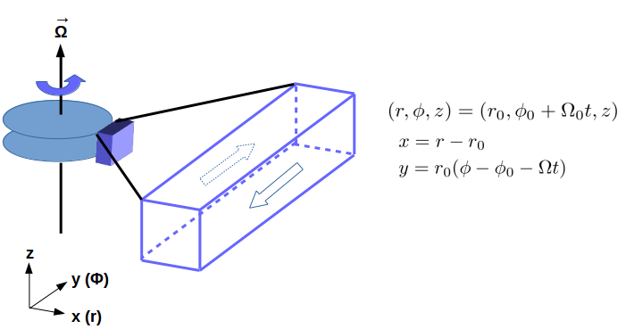

### Configuration
The shearing box module can be switched on with `-shear` option:
```
    > python configure.py -shear
```
### Input File
The default shearing box setup requires the `x1` (radial) direction to be shearing periodic, i.e.<var> f (x, y, z)</var> = <var> f (x + L<sub>x</sub>, y - q<var>&Omega;</var> L <sub>x</sub>t, z)</var>, where <var>f (x, y, z)</var> is a given variable, <var>L<sub>x</sub></var> is the `x1` (radial) extent of the computational domain, <var>q</var> is the shearing rate, and <var>&Omega;</var> is the local orbital frequency. It also asks `x2`(azimuthal) direction to be exact periodic. In order to achieve that, one has to change the `<mesh>` block as follows:
```
    <mesh>
    ix1_bc     = shear_periodic   # inner-X1 boundary flag
    ox1_bc     = shear_periodic   # outer-X1 boundary flag
    ix2_bc     = periodic         # inner-X2 boundary flag
    ox2_bc     = periodic         # outer-X2 boundary flag
```
The `x3`(vertical) boundaries may vary as the user's need. The other necessary shearing box parameters have to be specified are `qshear`, the shearing rate (<var>1.5</var> for Keplerian rotation), and local orbital frequency `Omega0`, e.g.,
```
    <problem>
    Omega0     = 1.0             # orbital frequency
    qshear     = 1.5             # shearing rate
    shboxcoord = 1               # 1: default x-y shear; 2: 2D x-z case 
```
By default, the extra parameter `shboxcoord` is set to <var>1</var>, i.e. shear in the x1-x2 (or horizontal x-y) plane; for 2D simulations in the vertical x-z plane, please set `shboxcoord = 2`, and `ix1_bc`/`ox1_bc` to `periodic` boundaries (see `pgen/hb3.cpp` for example).


##### Example 1:
The 2D MRI test in x-z plane (shear velocity perpendicular to the plane):
```
    > python configure.py -b -shear --prob=hb3 --flux=hlld --eos=isothermal
```
##### Example 2:
The 2D hydro shearing sheet test:
```
    > python configure.py -shear --prob=ssheet --flux=hlle --eos=isothermal
```
##### Example 3:
The 3D MRI/shwave test:
```
    > python configure.py -b -shear --prob=hgb --flux=hlld --eos=isothermal 
```
### Performance
We find only <var>~4%</var> slow down of the shearing box run compared to problems without the shearing box approximation due to the cost of extra boundary calls and MPI communications, when running 3D MHD problems of <var>128<sup>3</sup></var> grid points with MeshBlock size of <var>64<sup>3</sup></var>, with (`hgb.cpp`) and without (`shock_tube.cpp`) shearing box boundary conditions. When compiling with the Intel compiler v17.0 and default optimization, and <var>8</var> processors are employed, the averaged zone-cycles/second is <var>(5.8051 &plusmn; 0.0069) &times; 10<sup>6</sup></var> for the former while <var>(6.0245 &plusmn; 0.0419) &times; 10<sup>6</sup></var> for the latter.

### Note
* Mesh refinement in shearing box is currently not implemented yet.
* FARGO (Fast Advection in Rotating Gaseous Objects) scheme is currently not implemented yet.
* Uniform grid in `x2` (azimuthal) direction is required if the shear is in x-y plane.
