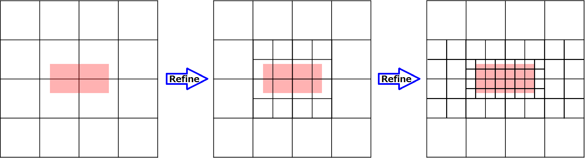

### Mesh Structure
The mesh structure in Athena++ is completely different from Athena. Athena used a grid structure like Berger & Colella (1989), in which rectangular finer grids can be placed anywhere in the computing domain. Although the terminology about mesh refinement is not well defined, here we call this a patch-based mesh refinement. In Athena++, we take a different approach that we call the oct-tree-block based mesh refinement. In this approach, the computational domain is split into small MeshBlocks, and each MeshBlock can be refined into smaller eight (in 3D; four in 2D, two in 1D) MeshBlocks self-similarly. This approach is less flexible but much simpler, therefore it is easier to implement and achieve better performance this way.

In Athena++, all the levels use the same time step (shared time stepping). This greatly simplifies the code and makes parallelization much easier.

### Setting Up Static Mesh Refinement
No reconfiguration of the code is required for using Static Mesh Refinement. Simply set the `<mesh>` `refinement` flag to "static" and add `<refinement[n]>` block(s) to the input file to specify regions covered by finer resolution.

```
<mesh>
...
refinement = static

<refinement1>
x1min = -0.1
x1max =  0.1
x2min = -0.1
x2max =  0.1
x3min = -0.1
x3max =  0.1
level = 2
```

Here `x?min` and `x?max` set the region covered by this resolution, and `level` specifies the required resolution. The root level is 0, and level n means it is 2<sup>n</sup> times finer than the root grid. There is no need to specify all the refinement regions. The code automatically calculate the minimal set of MeshBlocks required to cover the requested regions, so that MeshBlocks contact with other MeshBlocks on the same level or one level different. Also, it automatically takes care of periodic boundaries. Therefore, a user only needs to specify the regions where refinement is desired. Note that static mesh refinement can be used with any coordinate system, though spherical-like coordinates may require [[special consideration at the poles|Boundary-Conditions#polar-boundary-conditions]].

Here is a visual example of Static Mesh Refinement in Athena++.

The red region indicates where you want to refine, and each square represents a MeshBlock. The left panel shows the root grid, the center is one level refined, and the right is one more level refined. As you see, the code automatically creates additional MeshBlocks so that only one level difference is allowed between contacting MeshBlocks.

Do not forget to set the `<meshblock>` size (see [[Using MPI and OpenMP]]), otherwise the MeshBlock size is the same as the whole root grid. For better flexibility (i.e., higher adaptivity, more efficient grid generation) smaller MeshBlocks are better, but there is trade-off between performance and flexibility. We recommend at least 16<sup>3</sup> cells per MeshBlock.

### Checking the Mesh Structure
Because the code automatically generates MeshBlocks, it is difficult for users to predict how many MeshBlocks exist, and how many processes are required for efficient parallel simulation. In order to see this information, run the code with the `-m [nproc]` option (`nproc = 1` is fine at first).
```
> athena -i athinput.example -m 1
```
It will show a list of MeshBlocks. Then, based on the total number of MeshBlocks, you should decide how many processes should be used in order to balance the load as much as possible. By specifying nproc after the `-m` option, it shows the actual load balance. Note that the total number of MeshBlocks can be an unusual number, because Athena++ does not solve the overlapping coarse grids where finer MeshBlocks exist. In other words, when a MeshBlock is refined, it creates 8 fine MeshBlocks and destroys 1 coarse MeshBlock, yielding 7 MeshBlocks. This is more efficient than solving the unnecessary overlapping coarse regions. Also note that one process can own more than one MeshBlock, which is especially important when small MeshBlocks are used.

Note that our approach of oct-tree-block based mesh refinement tends to produce a lot of MeshBlocks. A user always should check the mesh structure before running simulations and check that it is reasonable.

#### Visualizing the Mesh Structure
The `-m` option produces the plain-text file "mesh_structure.dat" in the working directory. This file contains the (logical) distribution of MeshBlocks, and can be visualized using [[gnuplot|http://www.gnuplot.info/]]. You can see the mesh structure with
```
gnuplot> splot "mesh_structure.dat" with lines
```
In the case of 3D, this simply shows the spatial distribution of MeshBlocks in the logical coordinates. In 2D, the third dimension is the level of refinement.

The above plotting command assumes that the underlying [[Coordinate Systems and Meshes]] is Cartesian. In order to visualize the mesh structure generated by a solver using curvilinear coordinates, a 
[gnuplot mapping](http://gnuplot.sourceforge.net/docs_4.2/node199.html) can be used. For the cylindrical coordinates mapping, gnuplot assumes a column ordering (<var>&#981;</var>, <var>z</var>, <var>r</var>). Therefore, the 3D output file from Athena++ should be visualized with:
```
gnuplot> set mapping spherical 
gnuplot> splot "mesh_structure.dat" using 2:3:1 with lines
```

For the spherical coordinates mapping, gnuplot assumes a column ordering corresponding to (<var>&#981;</var>, <var>&theta;</var>, <var>r</var>). However, it uses a "geographic" spherical coordinate system (where <var>&theta;</var> =0 corresponds to the equator, not the pole). Therefore, the spherical-polar coordinates mapping for 3D outputs from Athena++ should be manually specified:
```
gnuplot> splot "mesh_structure.dat" using ($1*cos($3)*sin($2)):($1*sin($3)*sin($2)):($1*cos($2)) with lines
```


### Data Output
Because mesh refinement produces many MeshBlocks, we strongly recommend the HDF5 format for data output. This format is much more convenient than other serial formats because it contains a hierarchical structure within one file. Also, note that the `join_vtk++` tool (in `vis/vtk`) does not support data with mesh refinement for now.

### Changes from the old Athena
In Athena, the refinement region was called Domain. Each Domain was divided into Grids and one Grid corresponded to one process. In Athena++, this concept of Domain is discarded, and the computational domain (Mesh) is decomposed into MeshBlocks. The refinement level is now a property of each MeshBlock.
