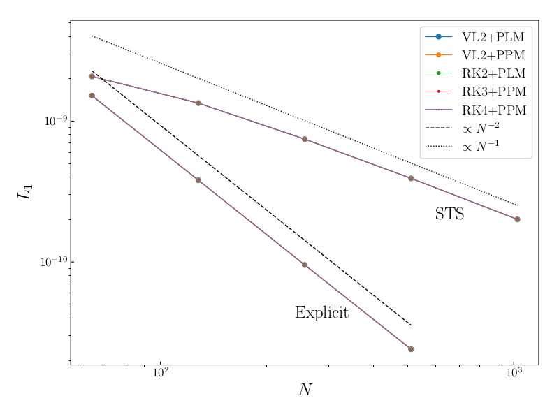
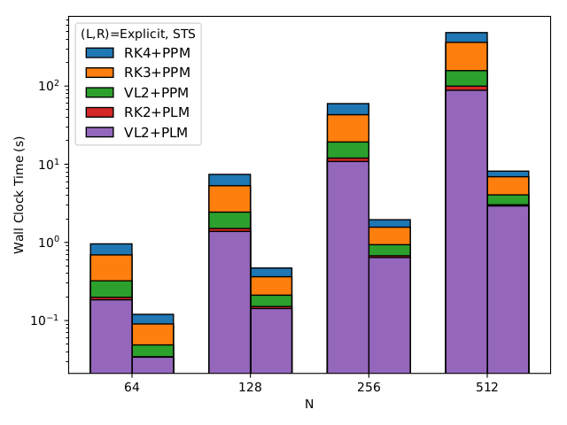

Explicit integration of diffusive physics requires taking a parabolic time-step, which is proportional to <a href="https://www.codecogs.com/eqnedit.php?latex=\Delta&space;x^2" target="_blank"></a>, where <a href="https://www.codecogs.com/eqnedit.php?latex=\Delta&space;x" target="_blank"></a> is the linear resolution of the calculation.  This parabolic time-step is often much smaller than the hyperbolic time-step, thus dramatically increasing the required compute time when running Athena++ with diffusive physics enabled.  

Super-time-stepping offers an avenue to alleviate some of the penalty associated with an explicit scheme.  When super-time-stepping is enabled, diffusive physics is treated in an operator-split fashion using the RKL1 algorithm (see [Meyer et al. 2014](http://adsabs.harvard.edu/abs/2014JCoPh.257..594M)).  This enables us to take the hyperbolic time-step inside the main integration loop, while diffusion physics is integrated over a super-time-step (equal to the hyperbolic time-step) in the operator-split update.  Each super-time-step is comprised of _s_ sub-stages where 


   <a href="https://www.codecogs.com/eqnedit.php?latex=s&space;=&space;\textrm{floor}\left[&space;\frac{1}{2}&space;\left(&space;\sqrt{1&plus;8&space;\frac{\Delta&space;t_\textrm{\small&space;hyperbolic}}{\Delta&space;t_{\textrm{\small&space;parabolic}}}}&space;-1&space;\right)&space;\right]&space;&plus;&space;1." target="_blank"></a>.  

The larger the ratio between the hyperbolic and parabolic time-step, the larger the value of _s_.  The speedup associated with super-time-stepping is proportional to _s_.

_Important Note:_ Super-time-stepping with the RKL1 algorithm is only a first-order scheme.  

### Configuration

Presently, super-time-stepping can only be applied to problems with diffusive physics.  To enable super-time-stepping, configure Athena++ with the `-sts` option.  

    > python configure.py -sts

### Input File
If super-time-stepping is enabled, at least one of the following input parameters for diffusion processes must be set in the input file under the `<problem>` block: 
```
    <problem>
    nu_iso      = 0.01       # isotropic viscosity coefficient
    nu_aniso    = 0.0        # anisotropic viscosity coefficient
    kappa_iso   = 0.01       # isotropic thermal conduction coefficient
    kappa_aniso = 0.0        # anisotropic thermal conduction coefficient
    eta_ohm     = 0.01       # Ohmic resistivity coefficient
    eta_ad      = 0.0        # Ambipolar diffusion coefficient
```

### Example 
Ohmic diffusion of a Gaussian magnetic field:

    > python configure.py -b -sts --prob=resist --flux=hlld --eos=isothermal

### Convergence and Performance
Error convergence and performance diagnostics for super-time-stepping vs. explicit integration in the Ohmic diffusion example problem:




### Notes
* Mesh refinement with super-time-stepping is not yet available.
* Time dependent boundary conditions (e.g., shearing BC's `-shear`) and source terms are not yet compatible with super-time-stepping.