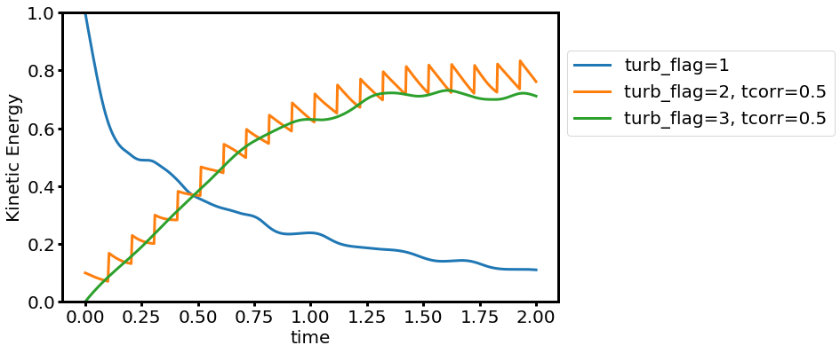
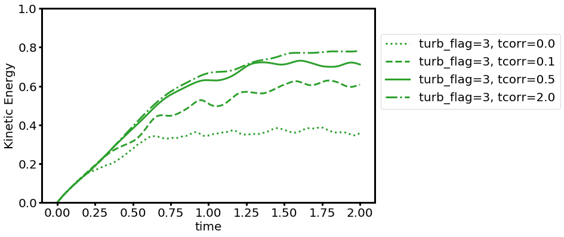

### Turbulence Driver
The turbulence driver will generate velocity perturbation in the Fourier space and add to the velocity field by taking the inverse [[FFT]]. The power spectrum of velocity perturbation follows a power law within wavenumber range between `nlow` and `nhigh` with an exponent set by `expo` parameter. For a given random number seed `rseed`, each velocity component is realized by a Gaussian random field. The velocity perturbation is decomposed into _solenoidal_ and _compressive_ components and added with a ratio set by `f_shear`. For example, if `f_shear=0`, turbulence driving is fully _compressive_, and if `f_shear=1`, turbulence driving is fully _solenoidal_.

There are three types of driving controlled by the parameter `turb_flag`:
* `turb_flag=1`: perturbation is only added at the beginning of the simulation (decaying turbulence). `dedt` in this case sets the total kinetic energy.
* `turb_flag=2`: perturbation is added with an interval set by a user by `dtdrive` (impulsive driving).
* `turb_flag=3`: perturbation is added continuously with an interval of the simulation time step `dt` (continuous driving). 

For driven turbulence (`turb_flag=2` and `3`), `dedt` denotes the energy injection rate so that the total kinetic energy injected at every driving step is `dedt`x`dtdrive` for `turb_flag=2` and `dedt`x`dt` for `turb_flag=3`. We adopt the Ornstein-Uhlenbeck process to smoothly change perturbations over the correlation time `tcorr`.

### Example

    > ./configure.py --prob=turb -fft
    > ./athena -i ../inputs/hydro/athinput.turb problem/turb_flag=[1,2,3]

The time evolution of kinetic energy for different `turb_flag` (`f_shear=0.5`, `dtdrive=0.1`, `tcorr=0.5`):

The time evolution of kinetic energy for different `tcorr` (`turb_flag=3`, `f_shear=0.5`):

