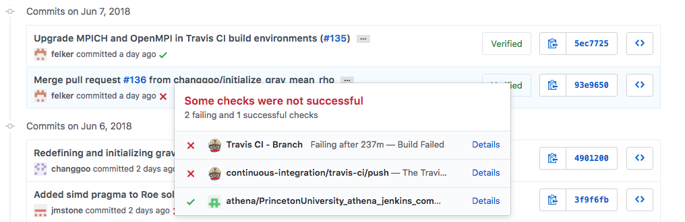

### Viewing build statuses and detailed build logs
For most Athena++ development, the user does not need to be concerned about the details of the continuous integration setup; the automated tools run silently in the background and will report one of the following status check symbols next to the commit, pull request, or branch:
- **Pending**: yellow circle
- **Passed**: green checkmark
- **Failed**: red x

Clicking the status check symbol will list the individual statuses for both Jenkins and Travis CI along with links to the build logs on the CI servers, for example:

The detailed build logs provide the console output of the automated test suite and should be consulted when a build is marked as failed in order to debug the code. In addition, the `README.md` in the project's root directory contains GitHub badges displayed on the main page of the repository. The clickable badges show the current states of the `master` branch builds on both platforms.
<!-- github.com is whitelisted for the Jenkins server, so this Badge status is automatically updated without being behind the Princeton firewall -->

Unlike Travis CI, the Jenkins server at PISciE requires a Jenkins account based on a [Princeton netID](http://www.princeton.edu/oit/students/getting-connected/), so users will not be able to view the build logs without one. Furthermore, access to the server is only available for connections behind the Princeton firewall and authenticated through the Central Authentication Service (CAS). Contact [David Luet](mailto:luet@Princeton.EDU) to request access to the Jenkins server and Read access for the Athena projects for your Princeton netID, especially if you work with vectorization or if your code often runs into problems with the Intel compiler. Princeton Research Computing also offers a [Jenkins Tutorial](http://jenkins-doc.princeton.edu/tutorial.html) and maintains a computing blog with [additional Jenkins information](https://oncomputingwell.princeton.edu/2018/01/triggering-a-jenkins-build-every-time-changes-are-pushed-to-a-git-branch-on-github/).

### Building pull requests
In addition to checking that any changes to `master` pass the tests, the CI servers can also be useful tools for iterative development of pull requests. Users are encouraged to open pull requests targeting the upstream `master` branch as soon as possible, even for incomplete feature branches. This will prompt Jenkins and Travis CI to immediately build a merged version of the pull request. Whenever new commits are added to the pull request's source branch, a new build is queued.

See subsections on building pull requests in the [[Jenkins]] and [[Travis CI]] Wiki pages for details specific to each platform.

### Adding and removing feature branches to CI testing
Travis CI and Jenkins testing can easily be extended from `master` to other branches by editing the `.travis.yml` file directly in the repository and the `PrincetonUniversity_athena_jenkins_branch` Project configuration at [https://jenkins.princeton.edu/](https://jenkins.princeton.edu/), respectively. 

### Tips and tricks
- `[<KEYWORD> skip]` or `[skip <KEYWORD>]`, where `<KEWYORD>` is either `ci`, `travis`, `travis ci`, `travis-ci`, or `travisci`, can be added anywhere to a commit message to [skip the Travis CI build](https://docs.travis-ci.com/user/customizing-the-build/#Skipping-a-build) for that commit. It is recommended to put these keywords in the commit message body, not the subject line. 
  - `[skip ci]` will also prevent Jenkins jobs that are triggered by pull requests targeting the `master` branch. This keyword can be modified, since it is managed by the [Jenkins GitHub Pull Request Builder Plugin](https://github.com/jenkinsci/ghprb-plugin)
  - `[ci skip]` will prevent Jenkins jobs that are triggered by pushes to GitHub. This keyword is not configurable, since it is managed by the [Jenskins CI Skip Plugin](https://github.com/banyan/jenkins-ci-skip-plugin).

### Maintaining CI infrastructure
When the [[Regression Testing]] files in `tst/regression/` change, the `tst/ci/travis/run_tests_travis.sh` and `tst/ci/jenkins/run_jenkins_perseus.sh` scripts may need to be manually updated in order to run the new tests correctly.

The `pgen_compile.py` regression test compiles each of the [[Problem Generators]] with a variety of solver configurations. The Bash script `tst/ci/set_warning_cflag.sh` is used to define compiler-dependent sets of warning flags to check for strict compliance in this regression test. If a new compiler version is added to the CI setups, this script may require modification.

The [code coverage](https://en.wikipedia.org/wiki/Code_coverage) of the regression tests should be periodically analyzed using services such as Codecov, Code Climate, etc.

<!--
**To add and document**:
- [ ] Code coverage analysis with Codecov, Code Climate, etc.
- [ ] Static program analysis with Coverity, etc.
- [ ] Checks API extension to Jenkins and annotations for build steps with Travis CI
- [ ] Short vs. long test sets via `cron`
-->
